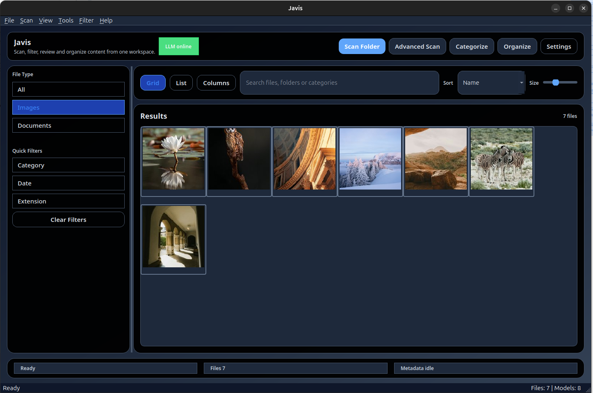
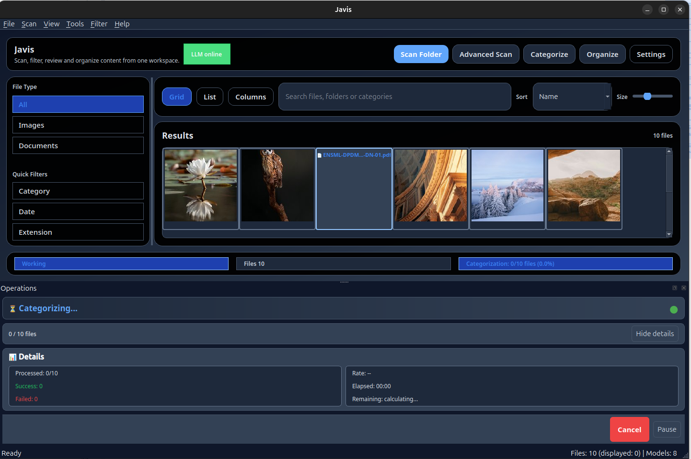
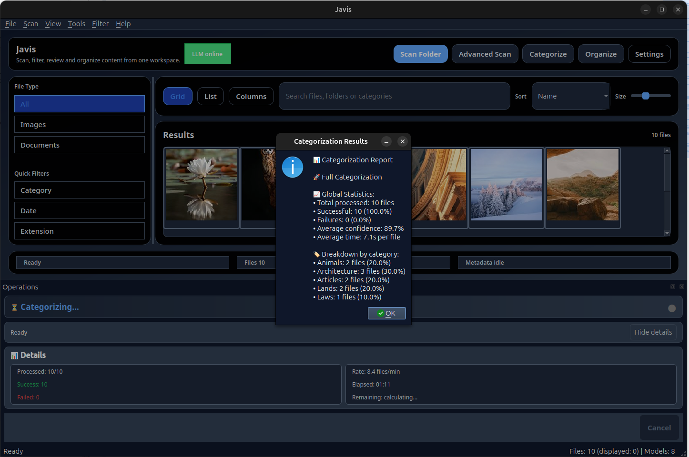
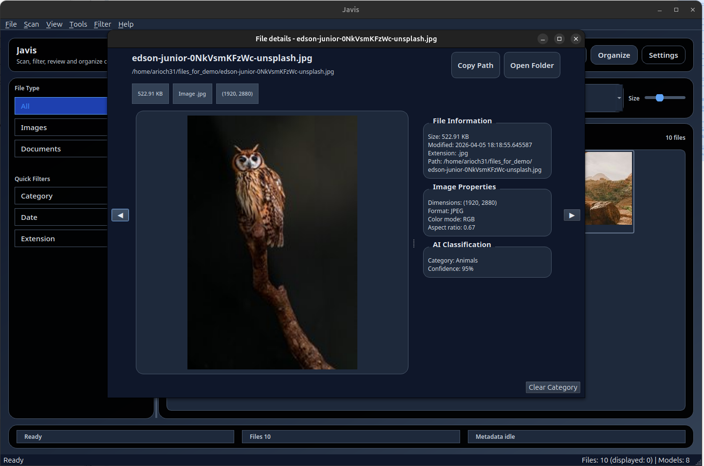

# Javis

> 🇫🇷 [Version française](README.fr.md)

Javis is a desktop app that helps you classify and organize large mixed file libraries
(documents, images, and more) using local AI models — no cloud required.

> **Personal project** — maintained in spare time. Issues and PRs are welcome,
> but response times are not guaranteed.

---

## Why Javis

You have thousands of files scattered across folders and external drives.
Sorting them manually takes hours. Javis scans your folders, extracts metadata,
and lets a local AI model categorize each file automatically — then helps you
organize everything in one workflow.

- **Local inference** — your data never leaves your machine.
- **Mixed libraries** — images and documents in the same workspace.
- **One workflow** — scan → categorize → organize.

---

## Screenshots

| Main view | Categorization in progress |
|---|---|
|  |  |

| Categorization report | File detail with AI classification |
|---|---|
|  |  |

---

## Quick Start

1. Install [Ollama](https://ollama.com) and pull a model:
```bash
   ollama pull llava:7b    # for images
   ollama pull llama3:8b   # for documents
```
2. Install and launch Javis (see [Prerequisites](#prerequisites) for your OS).
3. Click **Scan Folder**, then **Categorize** — Javis does the rest.

---

## Documentation

- Architecture (EN): `docs/ARCHITECTURE_V1.md`
- Architecture (FR): `docs/ARCHITECTURE_V1.fr.md`
- Functionalities (EN): `docs/FUNCTIONALITIES_V1.md`
- Functionalities (FR): `docs/FUNCTIONALITIES_V1.fr.md`

---

## Prerequisites

### Ubuntu 24.04

#### PyQt6 system packages
```bash
sudo apt update
sudo apt install -y python3-pyqt6
sudo apt install -y qt6-qpa-plugins libxcb-cursor0 libxkbcommon-x11-0 libgl1 libegl1
```

#### Optional Qt modules
```bash
sudo apt install -y python3-pyqt6.qtsvg python3-pyqt6.qtwebengine
```

#### Verify installation
```bash
python3 -c "from PyQt6.QtWidgets import QApplication; print('PyQt6 OK')"
```

#### Ollama
```bash
curl -fsSL https://ollama.com/install.sh | sh
```

#### Application
```bash
git clone https://github.com/arioch3131/javis.git
cd javis
pip install .
python src/ai_content_classifier/main.py
```

---

### Windows

#### Ollama

Download and install from https://ollama.com/download/windows

#### Application

Download the latest installer from the
[Releases page](https://github.com/arioch3131/javis/releases)
and run `Javis_setup.exe`.

No Python required for the installer build.

#### Windows from source (advanced)

1. Install Python 3.11 from https://www.python.org/downloads/windows/
2. Clone the repository and run the setup script:
```powershell
git clone https://github.com/arioch3131/javis.git
cd javis
powershell -ExecutionPolicy Bypass -File .\install_windows.ps1
```

3. Optional: run immediately after setup:
```powershell
powershell -ExecutionPolicy Bypass -File .\install_windows.ps1 -RunApp
```

If you do not use `-RunApp`, activate the virtual environment before running:
```powershell
.\.venv\Scripts\Activate.ps1
python src\ai_content_classifier\main.py
```

---

## Recommended AI Models

Pull models with `ollama pull <model>`.

### Images (vision)

| Model | Size | Min RAM | Min VRAM | Notes |
|---|---|---|---|---|
| `moondream` | ~1.5 GB | 4 GB | 2 GB | Ultra light, basic classification |
| `llava:7b` | ~4 GB | 8 GB | 6 GB | Recommended, good balance |
| `llava:13b` | ~8 GB | 16 GB | 10 GB | Best accuracy |

### Documents (text)

| Model | Size | Min RAM | Min VRAM | Notes |
|---|---|---|---|---|
| `gemma3:4b` | ~3 GB | 8 GB | 4 GB | Ultra light, basic classification |
| `llama3:8b` | ~5 GB | 8 GB | 6 GB | Recommended, fast and accurate |
| `gemma3:12b` | ~8 GB | 16 GB | 10 GB | Best accuracy |

> Without a dedicated GPU, inference time can become very high.
> CPU-only machines and shared-memory GPUs are not recommended.
> Models can be selected in application settings.

---

## Supported File Formats

By default, Javis handles:

- Images: `.jpg`, `.jpeg`, `.png`, `.gif`, `.bmp`, `.webp`, `.tiff`
- Documents: `.pdf`, `.docx`, `.txt`, `.md`, `.rtf`, `.odt`

Video and audio support is planned for a later version.

Default lists can be adjusted in Settings. Custom extensions can also be added in scan configuration.

---

## Tests
```bash
.venv/bin/python -m pytest -q
```

Headless Qt mode is auto-configured for tests via `tests/conftest.py`.

---

## Database Migrations (Alembic)

Migrations are applied automatically at app startup.

Manual commands if needed:
```bash
.venv/bin/python -m alembic -c pyproject.toml current
.venv/bin/python -m alembic -c pyproject.toml upgrade head
.venv/bin/python -m alembic -c pyproject.toml downgrade -1
```

---

## Contributing

Contributions are welcome. See [CONTRIBUTING.md](CONTRIBUTING.md) for translation
instructions and development guidelines.

---

## Disclaimer

This software is provided "as is", without warranty of any kind.
You use it at your own risk. The author is not liable for any damages,
including data loss or business interruption.

## License

GPL-3.0-only
