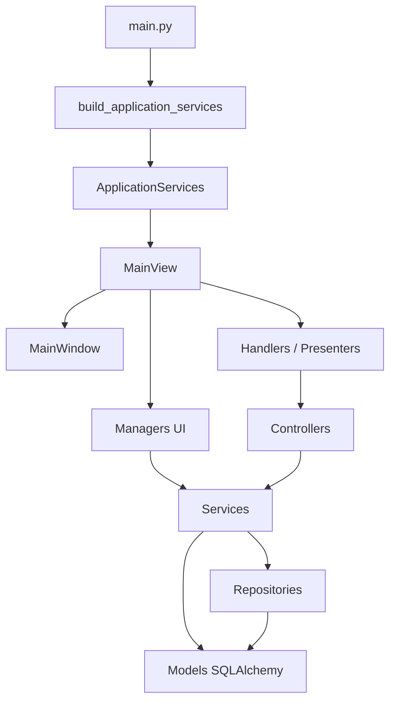
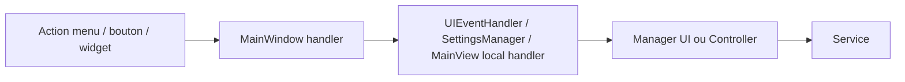
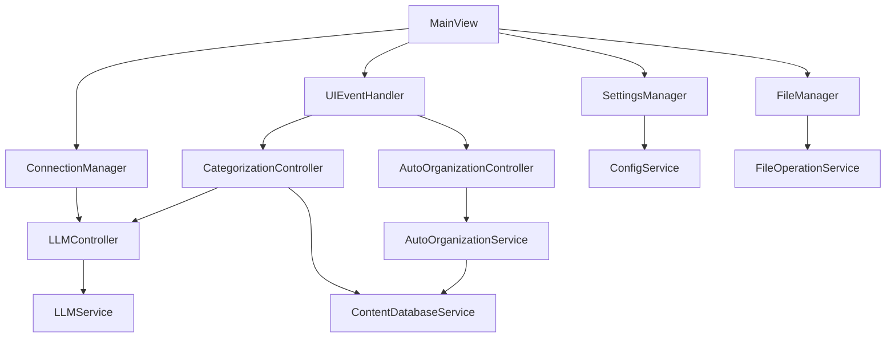
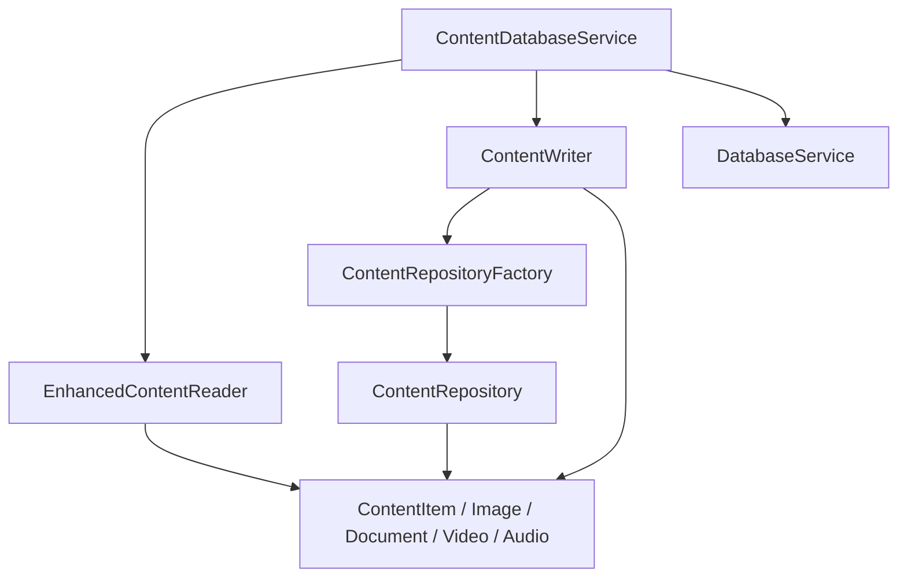
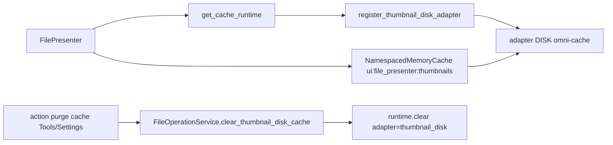

# Architecture V1

Ce document décrit l'architecture actuelle de `javis` / `ai_content_classifier` telle qu'elle est implémentée dans le code. L'objectif est de donner une vue d'ensemble exploitable pour la V1, avec un focus sur les relations entre `main`, `MainView`, les widgets, les controllers, les services, les repositories et les models.

## 1. Vue globale

L'application est une application desktop PyQt6 organisée autour de cinq couches principales :

1. `Bootstrap`
   Charge Qt, initialise les services durables et crée la vue principale.
2. `View`
   Regroupe `MainView`, `MainWindow`, les widgets, dialogs, presenters, managers UI et handlers.
3. `Controller`
   Orchestration orientée cas d'usage ou interaction longue, en particulier pour LLM, catégorisation, scan et organisation.
4. `Service`
   Logique métier et accès applicatif aux sous-systèmes: base de données, scan, métadonnées, vignettes, configuration, LLM.
5. `Repository / Model`
   Persistance SQLAlchemy et définitions de données.

Schéma global :



## 2. Bootstrap et assemblage

Le point d'entrée est [main.py](../src/ai_content_classifier/main.py). Il :

- configure le logging ;
- crée `QApplication` ;
- construit le graphe de services via `build_application_services()` ;
- instancie `MainView` ;
- affiche la fenêtre principale ;
- délègue le nettoyage à `MainView.cleanup()` à la fermeture.

Le bootstrap applicatif est centralisé dans [app_context.py](../src/ai_content_classifier/app_context.py).

`ApplicationServices` est le conteneur des dépendances durables injectées dans la vue :

- `DatabaseService`
- `ConfigService`
- `QueryOptimizer`
- `PerformanceMetrics`
- `ContentDatabaseService`
- `MetadataService`
- `ThumbnailService`
- `LLMService`
- `LLMController`

Ce fichier joue le rôle de composition root de l'application.

## 3. Vue principale et shell UI

### 3.1 MainView

[MainView](../src/ai_content_classifier/views/main_view.py) est l'orchestrateur UI de haut niveau.

Ses responsabilités principales :

- recevoir les services partagés créés au bootstrap ;
- créer `MainWindow` ;
- créer les managers UI ;
- créer les handlers et presenters ;
- connecter les signaux Qt ;
- relier les handlers du shell UI aux opérations métier.

`MainView` n'implémente pas directement la logique métier profonde. Il assemble et relie les composants.

### 3.2 MainWindow

[MainWindow](../src/ai_content_classifier/views/main_window/main.py) est le shell principal de l'interface.

Ses responsabilités :

- porter la fenêtre principale Qt ;
- déléguer la construction des menus à `MenuBuilder` ;
- déléguer la construction des widgets à `UIBuilder` ;
- exposer des signaux d'interface (`filter_changed`, `view_mode_changed`, etc.) ;
- exposer une couche de compatibilité pour le reste du code (`handle_scan_request`, `set_thumbnail_generator`, `get_widget`, `get_action`, etc.).

Le shell ne décide pas seul de la logique métier. Il offre surtout un point de contact stable pour `MainView`, les widgets et les handlers.

## 4. Liens entre les widgets et Main

Les liens entre les widgets et le shell principal passent surtout par `MainWindow`, `UIBuilder` et `MenuBuilder`.

### 4.1 Construction des widgets

[UIBuilder](../src/ai_content_classifier/views/main_window/ui_builder.py) construit l'interface principale :

- barre d'action supérieure ;
- zone de contenu ;
- panneau latéral ;
- zone centrale ;
- widgets de résultats ;
- panneau de statut ;
- docks et widgets critiques.

Après construction, `UIBuilder` expose explicitement plusieurs widgets sur `MainWindow` :

- `thumbnail_grid_widget`
- `file_list_widget`
- `columns_widget`
- `adaptive_preview_widget`
- `filter_sidebar`
- `active_filters_bar`
- `progress_panel`
- `log_console_widget`
- `search_input`
- `sort_combo`

Cela permet à `MainView`, aux handlers, aux presenters et aux managers de manipuler ces composants sans connaître la structure interne complète du layout.

### 4.2 Construction des menus et actions

[MenuBuilder](../src/ai_content_classifier/views/main_window/menu_builder.py) crée :

- les actions Qt ;
- la barre de menus ;
- les toolbars ;
- les groupes d'actions et raccourcis.

Les actions sont enregistrées dans des registres (`actions`, `menus`, `toolbars`) puis exposées via `MainWindow.get_action()`.

### 4.3 Raccordement des handlers à MainWindow

Le raccordement réel entre l'UI et l'orchestration se fait dans `MainView._connect_main_window_handlers()`.

Le flux est le suivant :



Exemples de mapping :

- `handle_scan_request` -> `UIEventHandler.handle_scan_request`
- `handle_open_folder_request` -> `UIEventHandler.handle_open_folder_request`
- `handle_settings_request` -> `SettingsManager.open_settings_dialog`
- `handle_categorization_request` -> `UIEventHandler.handle_categorization_request`
- `handle_auto_organize_request` -> `UIEventHandler.handle_organize_request`

Autrement dit, `MainWindow` expose les points d'entrée, mais `MainView` décide à qui ces points d'entrée sont reliés.

## 5. Liens entre View, services et controllers

La couche View est composée de plusieurs sous-rôles :

- `MainView` : orchestration globale ;
- `MainWindow` : shell principal ;
- `UIEventHandler` : point d'entrée central des événements UI ;
- `Managers` : adaptateurs UI/Qt ;
- `Presenters` : transformation des données pour affichage ;
- `Widgets / Dialogs` : composants visuels ;
- `Workers Qt` : exécution asynchrone côté interface.

### 5.1 UIEventHandler comme hub côté view

[UIEventHandler](../src/ai_content_classifier/views/handlers/ui_event_handler.py) est la pièce centrale entre l'interface et l'orchestration métier.

Il reçoit :

- `MainWindow`
- `SettingsManager`
- `FileManager`
- `LLMController`
- `ContentDatabaseService`

Il crée ensuite deux controllers métier UI-driven :

- `CategorizationController`
- `AutoOrganizationController`

Il ouvre aussi les dialogs de scan et de sélection, puis déclenche les opérations appropriées.

### 5.2 Managers UI

Les managers UI encapsulent la logique spécifique à Qt et délèguent la logique métier réelle :

- [FileManager](../src/ai_content_classifier/views/managers/file_manager.py)
  adapte les opérations fichiers/scan pour l'UI ;
- [SettingsManager](../src/ai_content_classifier/views/managers/settings_manager.py)
  gère l'ouverture du dialogue de configuration ;
- [ConnectionManager](../src/ai_content_classifier/views/managers/connection_manager.py)
  adapte `LLMController` au monde Qt/UI.

Le point important est le suivant :

- la `View` ne parle pas directement à la base ou au LLM brut ;
- elle passe soit par un manager UI, soit par un controller, soit par un service de haut niveau injecté.

### 5.3 Presenters

Les presenters servent de couche d'adaptation des données vers les widgets :

- `FilePresenter` s'appuie sur `ContentDatabaseService`, `ThumbnailService` et `MetadataService` ;
- `StatusPresenter` met à jour l'état visuel de la fenêtre.

## 6. Liens entre controllers et services

Les controllers portent des cas d'usage transverses ou asynchrones. Ils ne stockent pas la donnée durable eux-mêmes.

### 6.1 LLMController

[LLMController](../src/ai_content_classifier/controllers/llm_controller.py) est un adaptateur Qt autour de `LLMService`.

Relation :

```text
LLMController -> LLMService
```

Responsabilités :

- exposer des signaux Qt ;
- lancer des opérations asynchrones ;
- déléguer toute la logique métier LLM au service.

### 6.2 CategorizationController

[CategorizationController](../src/ai_content_classifier/controllers/categorization_controller.py) orchestre la catégorisation de lots de fichiers.

Relations principales :

```text
CategorizationController
-> LLMController
-> SettingsManager
-> FileManager
-> ContentDatabaseService
```

Le worker interne :

- appelle `LLMService` pour classifier ;
- écrit le résultat via `ContentDatabaseService.update_content_category()` ;
- réutilise le cache pour les doublons.

### 6.3 AutoOrganizationController

[AutoOrganizationController](../src/ai_content_classifier/controllers/auto_organization_controller.py) orchestre l'organisation automatique.

Relation :

```text
AutoOrganizationController -> AutoOrganizationService -> ContentDatabaseService
```

Le controller :

- valide et démarre l'opération ;
- crée un worker Qt ;
- pousse l'état de progression vers l'UI.

### 6.4 ScanController

[ScanController](../src/ai_content_classifier/controllers/scan_controller.py) orchestre un pipeline de scan complet.

Relations :

```text
ScanController
-> ScanPipelineService
-> MetadataService
-> ThumbnailService
-> db_service
```

Même si aujourd'hui la chaîne de scan passe beaucoup par `FileManager` et les services fichiers, `ScanController` reste la façade orientée orchestration pour ce cas d'usage.

## 7. Liens entre controllers et services côté UI

Schéma synthétique :



## 8. Liens entre services, repositories et models

### 8.1 Couche configuration

La chaîne de configuration est simple :

```text
ConfigRepository -> AppSettings
ConfigService -> ConfigRepository
```

Détails :

- [ConfigRepository](../src/ai_content_classifier/repositories/config_repository.py) lit et écrit les réglages persistés ;
- [AppSettings](../src/ai_content_classifier/models/settings_models.py) est le modèle SQLAlchemy de stockage clé/valeur ;
- [ConfigService](../src/ai_content_classifier/services/settings/config_service.py) applique la sémantique métier, le cache et les conversions de types ;
- [ConfigKey](../src/ai_content_classifier/models/config_models.py) définit les clés de configuration et leur typage logique.

### 8.2 Couche contenu / base de données

La couche contenu suit une structure service -> reader/writer -> repository/model.

Schéma :



Rôles :

- [DatabaseService](../src/ai_content_classifier/services/database/database_service.py)
  gère l'engine SQLAlchemy, les sessions, la création de schéma et les migrations simples ;
- [ContentDatabaseService](../src/ai_content_classifier/services/database/content_database_service.py)
  est la façade principale de persistance pour le reste de l'application ;
- `EnhancedContentReader` et `ContentWriter`
  portent les opérations de lecture et d'écriture ;
- [ContentRepositoryFactory](../src/ai_content_classifier/repositories/content_repository.py)
  construit les repositories typés ;
- [ContentRepository](../src/ai_content_classifier/repositories/content_repository.py)
  encapsule des opérations génériques par type ;
- [ContentItem](../src/ai_content_classifier/models/content_models.py) et ses sous-classes
  portent les données métier persistées.

Il existe aussi un alias historique [services/content_database_service.py](../src/ai_content_classifier/services/content_database_service.py), qui ré-exporte `services.database.content_database_service.ContentDatabaseService` pour compatibilité d'import.

### 8.3 Couche métadonnées

Chaîne principale :

```text
MetadataService -> extractors spécialisés -> fichier
MetadataService -> cache_runtime
```

[MetadataService](../src/ai_content_classifier/services/metadata/metadata_service.py) :

- charge dynamiquement les extracteurs ;
- choisit l'extracteur adapté ;
- normalise certaines métadonnées ;
- met en cache les résultats.

Les extracteurs dérivent de [BaseMetadataExtractor](../src/ai_content_classifier/services/metadata/extractors/base_extractor.py).

### 8.4 Couche scan et fichiers

Chaîne principale :

```text
FileManager -> FileOperationService
ScanController -> ScanPipelineService -> scanner local + services associés
```

Les services fichiers combinent :

- scan du filesystem ;
- création / mise à jour des enregistrements ;
- extraction de métadonnées ;
- génération de vignettes ;
- filtrage de la liste affichée.

### 8.5 Couche LLM

Chaîne principale :

```text
ConnectionManager -> LLMController -> LLMService
CategorizationController -> LLMController -> LLMService
```

`LLMService` s'appuie ensuite sur plusieurs services spécialisés :

- client API ;
- model manager ;
- category analyzer ;
- configuration ;
- base de données.

### 8.6 Intégration cache_runtime et omni-cache

La V1 utilise un wrapper runtime unique autour de `omni-cache` :

- [OmniCacheRuntime](../src/ai_content_classifier/services/shared/cache_runtime.py)
- accès singleton via `get_cache_runtime()`
- fallback propre si `omni-cache` n'est pas disponible

Ce runtime est volontairement transverse à plusieurs modules, pas uniquement aux thumbnails.

#### 8.6.1 Adapters utilisés dans le projet

1. `memory` (key/value)
- adapter par défaut pour la majorité des caches applicatifs courte durée
- utilisé via `runtime.get/set/delete(..., adapter="memory")` ou `runtime.memory_cache(...)`

2. `thumbnail_disk` (DISK key/value)
- enregistré par `FilePresenter` via `register_thumbnail_disk_adapter(...)`
- stocke les payloads de thumbnails avec TTL/cleanup gérés par le backend
- stratégie de version :
  - `omni-cache 2.0.0` : `max_size` ignoré
  - `omni-cache 2.1.0+` : `max_size` activé automatiquement

3. Adapters SmartPool
- enregistrés via `register_smartpool_adapter(...)`
- utilisés pour le pooling d'objets (pas du key/value simple)
- exemples :
  - pools mémoire/objets de `ThumbnailService` via `SmartPoolHandle`
  - pool pixmap grille (`thumbnail_grid_qpixmap_*`) dans [grid_core.py](../src/ai_content_classifier/views/widgets/grid/grid_core.py)

#### 8.6.2 Caches namespacés actuellement utilisés

Exemples de namespaces actifs :

- `settings:config_service`
- `shared:dependency_manager:availability`
- `llm:classification`
- `llm:model_manager:models`
- `llm:model_manager:api_urls`
- `metadata:entries`
- `preprocessing:text_extraction`
- `categorization:duplicate_hash_reuse`
- `ui:file_presenter:thumbnails` (adossé à `thumbnail_disk` quand activé)

Cela isole les clés et statistiques par module tout en partageant un runtime unique.

#### 8.6.3 Pourquoi ce pattern d'intégration

La couche runtime apporte :

- une API stable pour les services (`memory_cache`, `get/set/delete/clear`)
- un point central d'enregistrement des adapters
- une sémantique de fallback cohérente
- une migration simplifiée des capacités backend (`2.0.0 -> 2.1.0+`) sans changer les APIs des modules

#### 8.6.4 Flux opérationnel (exemple thumbnail)



Point clé V1.3 :
- TTL et nettoyage périodique sont délégués au backend DISK de `omni-cache` pour les entrées de cache thumbnails.

## 9. Flux principaux de la V1

### 9.1 Démarrage

```text
main.py
-> build_application_services()
-> MainView
-> MainWindow
-> UIBuilder / MenuBuilder
-> managers / handlers / presenters
-> connexion des signaux
```

### 9.2 Scan

```text
Utilisateur
-> action MainWindow
-> UIEventHandler
-> FileManager.start_scan()
-> FileOperationService / worker Qt
-> ContentDatabaseService + MetadataService + ThumbnailService
-> signaux Qt
-> widgets de résultats
```

### 9.3 Catégorisation

```text
Utilisateur
-> UIEventHandler.handle_categorization_request()
-> CategorizationController
-> LLMController / LLMService
-> ContentDatabaseService.update_content_category()
-> rafraîchissement de la vue
```

### 9.4 Organisation

```text
Utilisateur
-> UIEventHandler.handle_organize_request()
-> AutoOrganizationController
-> AutoOrganizationService
-> opérations filesystem
-> progression UI + état final
```

## 10. Principes d'architecture actuellement visibles

Principes déjà présents dans le code :

- `composition root` clair dans `app_context.py` ;
- séparation explicite entre shell UI, orchestration UI et logique métier ;
- services injectés dans la vue au lieu d'être recréés localement ;
- controllers focalisés sur l'orchestration et l'asynchronisme ;
- services de haut niveau servant de façade vers les sous-systèmes ;
- persistance regroupée autour de `DatabaseService`, `ContentDatabaseService`, repositories et modèles SQLAlchemy ;
- présence de couches de compatibilité pour limiter les régressions pendant le refactoring.

## 11. Points d'attention pour la suite

L'architecture V1 est cohérente, mais quelques zones restent hybrides :

- certaines responsabilités de scan sont partagées entre `FileManager`, `ScanController` et les services fichiers ;
- `ContentDatabaseService` sert déjà de façade, mais des imports de compatibilité existent encore ;
- la frontière `controller` / `manager UI` est globalement claire, mais quelques chemins passent encore directement du view layer vers un service injecté ;
- la couche `views/main_window/*` contient plusieurs mécanismes de compatibilité, signe qu'un refactoring est encore en cours.

Pour la V1, ces points sont acceptables tant que le flux global reste :

```text
View -> Handler / Manager / Controller -> Service -> Repository -> Model
```
