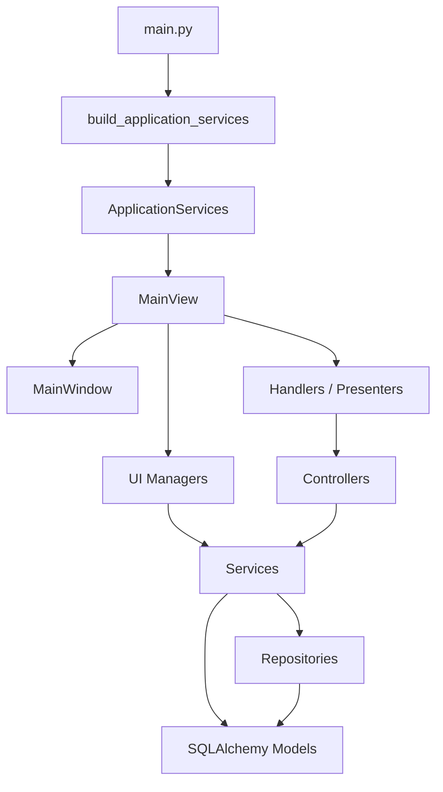
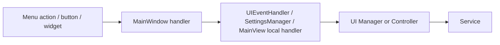
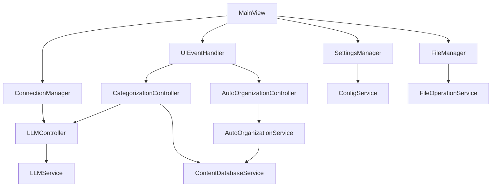
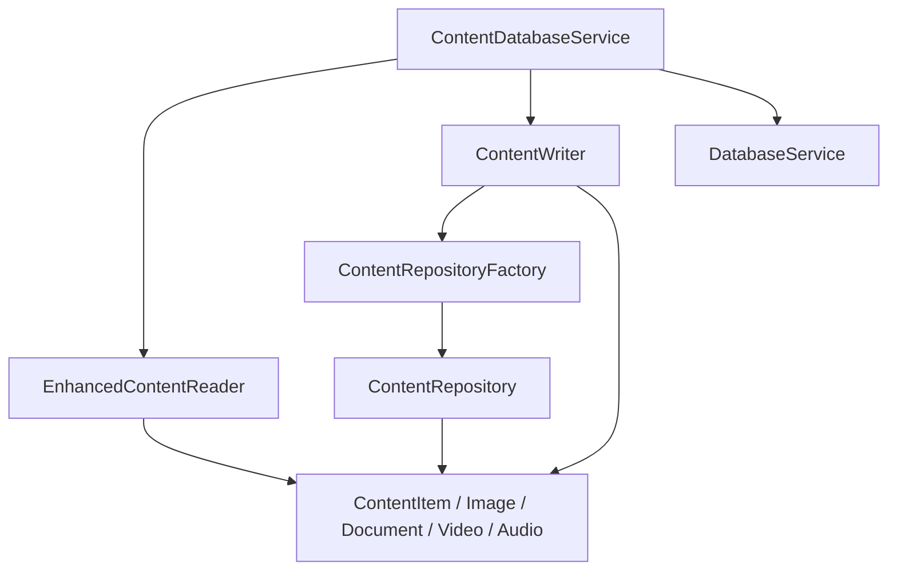

# V1 Architecture

This document describes the current architecture of `javis` / `ai_content_classifier` as implemented in the codebase. The goal is to provide a practical V1 overview, with a focus on the relationships between `main`, `MainView`, widgets, controllers, services, repositories, and models.

## 1. Global View

The application is a PyQt6 desktop application organized into five main layers:

1. `Bootstrap`
   Loads Qt, initializes long-lived services, and creates the main view.
2. `View`
   Includes `MainView`, `MainWindow`, widgets, dialogs, presenters, UI managers, and handlers.
3. `Controller`
   Use-case orchestration and long-running interactions, especially for LLM, categorization, scan, and organization.
4. `Service`
   Business logic and application access to subsystems: database, scan, metadata, thumbnails, configuration, and LLM.
5. `Repository / Model`
   SQLAlchemy persistence and data definitions.

Global diagram:



## 2. Bootstrap and Assembly

The entry point is [main.py](../src/ai_content_classifier/main.py). It:

- configures logging;
- creates `QApplication`;
- builds the service graph with `build_application_services()`;
- instantiates `MainView`;
- shows the main window;
- delegates shutdown cleanup to `MainView.cleanup()`.

Application bootstrap is centralized in [app_context.py](../src/ai_content_classifier/app_context.py).

`ApplicationServices` is the container for long-lived dependencies injected into the view:

- `DatabaseService`
- `ConfigService`
- `QueryOptimizer`
- `PerformanceMetrics`
- `ContentDatabaseService`
- `MetadataService`
- `ThumbnailService`
- `LLMService`
- `LLMController`

This file acts as the composition root of the application.

## 3. Main View and UI Shell

### 3.1 MainView

[MainView](../src/ai_content_classifier/views/main_view.py) is the high-level UI orchestrator.

Main responsibilities:

- receive shared services created during bootstrap;
- create `MainWindow`;
- create UI managers;
- create handlers and presenters;
- connect Qt signals;
- bind UI shell handlers to business operations.

`MainView` does not directly implement deep business logic. It assembles and wires components.

### 3.2 MainWindow

[MainWindow](../src/ai_content_classifier/views/main_window/main.py) is the main UI shell.

Responsibilities:

- host the Qt main window;
- delegate menu construction to `MenuBuilder`;
- delegate widget construction to `UIBuilder`;
- expose UI signals (`filter_changed`, `view_mode_changed`, etc.);
- expose a compatibility layer for the rest of the code (`handle_scan_request`, `set_thumbnail_generator`, `get_widget`, `get_action`, etc.).

The shell does not decide business logic by itself. It provides a stable contact point for `MainView`, widgets, and handlers.

## 4. Links Between Widgets and Main

The links between widgets and the main shell mainly go through `MainWindow`, `UIBuilder`, and `MenuBuilder`.

### 4.1 Widget Construction

[UIBuilder](../src/ai_content_classifier/views/main_window/ui_builder.py) builds the main interface:

- top action bar;
- content area;
- sidebar;
- central area;
- results widgets;
- status panel;
- critical docks and widgets.

After construction, `UIBuilder` explicitly exposes several widgets on `MainWindow`:

- `thumbnail_grid_widget`
- `file_list_widget`
- `columns_widget`
- `adaptive_preview_widget`
- `filter_sidebar`
- `active_filters_bar`
- `progress_panel`
- `log_console_widget`
- `search_input`
- `sort_combo`

This allows `MainView`, handlers, presenters, and managers to manipulate those components without knowing the full internal layout structure.

### 4.2 Menu and Action Construction

[MenuBuilder](../src/ai_content_classifier/views/main_window/menu_builder.py) creates:

- Qt actions;
- menu bar;
- toolbars;
- action groups and shortcuts.

Actions are stored in registries (`actions`, `menus`, `toolbars`) and exposed through `MainWindow.get_action()`.

### 4.3 Binding Handlers to MainWindow

The actual UI-to-orchestration binding is done in `MainView._connect_main_window_handlers()`.

Flow:



Mapping examples:

- `handle_scan_request` -> `UIEventHandler.handle_scan_request`
- `handle_open_folder_request` -> `UIEventHandler.handle_open_folder_request`
- `handle_settings_request` -> `SettingsManager.open_settings_dialog`
- `handle_categorization_request` -> `UIEventHandler.handle_categorization_request`
- `handle_auto_organize_request` -> `UIEventHandler.handle_organize_request`

In other words, `MainWindow` exposes entry points, while `MainView` decides where they are routed.

## 5. Links Between View, Services, and Controllers

The View layer is split into several roles:

- `MainView`: global orchestration;
- `MainWindow`: main shell;
- `UIEventHandler`: central entry point for UI events;
- `Managers`: UI/Qt adapters;
- `Presenters`: data adaptation for display;
- `Widgets / Dialogs`: visual components;
- `Qt Workers`: asynchronous execution on the UI side.

### 5.1 UIEventHandler as the View Hub

[UIEventHandler](../src/ai_content_classifier/views/handlers/ui_event_handler.py) is the central piece between the interface and business orchestration.

It receives:

- `MainWindow`
- `SettingsManager`
- `FileManager`
- `LLMController`
- `ContentDatabaseService`

It then creates two UI-driven business controllers:

- `CategorizationController`
- `AutoOrganizationController`

It also opens scan/selection dialogs and triggers the appropriate operations.

### 5.2 UI Managers

UI managers encapsulate Qt-specific logic and delegate real business logic:

- [FileManager](../src/ai_content_classifier/views/managers/file_manager.py)
  adapts file/scan operations to the UI;
- [SettingsManager](../src/ai_content_classifier/views/managers/settings_manager.py)
  manages the settings dialog opening;
- [ConnectionManager](../src/ai_content_classifier/views/managers/connection_manager.py)
  adapts `LLMController` to Qt/UI.

Important point:

- the `View` does not talk directly to raw DB or raw LLM;
- it goes through a UI manager, a controller, or an injected high-level service.

### 5.3 Presenters

Presenters are a data adaptation layer for widgets:

- `FilePresenter` relies on `ContentDatabaseService`, `ThumbnailService`, and `MetadataService`;
- `StatusPresenter` updates main window visual state.

## 6. Links Between Controllers and Services

Controllers handle cross-cutting or asynchronous use cases. They do not store durable data themselves.

### 6.1 LLMController

[LLMController](../src/ai_content_classifier/controllers/llm_controller.py) is a Qt adapter around `LLMService`.

Relation:

```text
LLMController -> LLMService
```

Responsibilities:

- expose Qt signals;
- launch asynchronous operations;
- delegate all LLM business logic to the service.

### 6.2 CategorizationController

[CategorizationController](../src/ai_content_classifier/controllers/categorization_controller.py) orchestrates batch file categorization.

Main relations:

```text
CategorizationController
-> LLMController
-> SettingsManager
-> FileManager
-> ContentDatabaseService
```

The internal worker:

- calls `LLMService` for classification;
- writes results via `ContentDatabaseService.update_content_category()`;
- reuses cache for duplicates.

### 6.3 AutoOrganizationController

[AutoOrganizationController](../src/ai_content_classifier/controllers/auto_organization_controller.py) orchestrates automatic organization.

Relation:

```text
AutoOrganizationController -> AutoOrganizationService -> ContentDatabaseService
```

The controller:

- validates and starts operations;
- creates a Qt worker;
- pushes progress state to the UI.

### 6.4 ScanController

[ScanController](../src/ai_content_classifier/controllers/scan_controller.py) orchestrates a full scan pipeline.

Relations:

```text
ScanController
-> ScanPipelineService
-> MetadataService
-> ThumbnailService
-> db_service
```

Even if the scan chain currently goes heavily through `FileManager` and file services, `ScanController` remains the orchestration facade for this use case.

## 7. Links Between Controllers and Services on the UI Side

Synthetic diagram:



## 8. Links Between Services, Repositories, and Models

### 8.1 Configuration Layer

The configuration chain is simple:

```text
ConfigRepository -> AppSettings
ConfigService -> ConfigRepository
```

Details:

- [ConfigRepository](../src/ai_content_classifier/repositories/config_repository.py) reads/writes persisted settings;
- [AppSettings](../src/ai_content_classifier/models/settings_models.py) is the SQLAlchemy key/value model;
- [ConfigService](../src/ai_content_classifier/services/settings/config_service.py) applies business semantics, caching, and type conversion;
- [ConfigKey](../src/ai_content_classifier/models/config_models.py) defines configuration keys and logical typing.

### 8.2 Content / Database Layer

The content layer follows a service -> reader/writer -> repository/model structure.

Diagram:



Roles:

- [DatabaseService](../src/ai_content_classifier/services/database/database_service.py)
  manages SQLAlchemy engine, sessions, schema creation, and simple migrations;
- [ContentDatabaseService](../src/ai_content_classifier/services/database/content_database_service.py)
  is the main persistence facade for the rest of the application;
- `EnhancedContentReader` and `ContentWriter`
  implement read/write operations;
- [ContentRepositoryFactory](../src/ai_content_classifier/repositories/content_repository.py)
  builds typed repositories;
- [ContentRepository](../src/ai_content_classifier/repositories/content_repository.py)
  encapsulates generic operations by type;
- [ContentItem](../src/ai_content_classifier/models/content_models.py) and subclasses
  represent persisted business data.

There is also a historical alias [services/content_database_service.py](../src/ai_content_classifier/services/content_database_service.py), re-exporting `services.database.content_database_service.ContentDatabaseService` for import compatibility.

### 8.3 Metadata Layer

Main chain:

```text
MetadataService -> specialized extractors -> file
MetadataService -> cache_runtime
```

[MetadataService](../src/ai_content_classifier/services/metadata/metadata_service.py):

- dynamically loads extractors;
- picks the right extractor;
- normalizes some metadata;
- caches results.

Extractors derive from [BaseMetadataExtractor](../src/ai_content_classifier/services/metadata/extractors/base_extractor.py).

### 8.4 Scan and File Layer

Main chain:

```text
FileManager -> FileOperationService
ScanController -> ScanPipelineService -> local scanner + related services
```

File services combine:

- filesystem scan;
- record creation/update;
- metadata extraction;
- thumbnail generation;
- filtering of displayed list.

### 8.5 LLM Layer

Main chain:

```text
ConnectionManager -> LLMController -> LLMService
CategorizationController -> LLMController -> LLMService
```

`LLMService` then relies on specialized services:

- API client;
- model manager;
- category analyzer;
- configuration;
- database.

## 9. Main V1 Flows

### 9.1 Startup

```text
main.py
-> build_application_services()
-> MainView
-> MainWindow
-> UIBuilder / MenuBuilder
-> managers / handlers / presenters
-> signal wiring
```

### 9.2 Scan

```text
User
-> MainWindow action
-> UIEventHandler
-> FileManager.start_scan()
-> FileOperationService / Qt worker
-> ContentDatabaseService + MetadataService + ThumbnailService
-> Qt signals
-> result widgets
```

### 9.3 Categorization

```text
User
-> UIEventHandler.handle_categorization_request()
-> CategorizationController
-> LLMController / LLMService
-> ContentDatabaseService.update_content_category()
-> view refresh
```

### 9.4 Organization

```text
User
-> UIEventHandler.handle_organize_request()
-> AutoOrganizationController
-> AutoOrganizationService
-> filesystem operations
-> UI progress + final state
```

## 10. Architecture Principles Currently Visible

Principles already present in the code:

- clear `composition root` in `app_context.py`;
- explicit separation between UI shell, UI orchestration, and business logic;
- services injected into the view instead of re-created locally;
- controllers focused on orchestration and async flows;
- high-level services used as subsystem facades;
- persistence organized around `DatabaseService`, `ContentDatabaseService`, repositories, and SQLAlchemy models;
- compatibility layers to limit regressions during refactoring.

## 11. Attention Points for Next Iterations

V1 architecture is coherent, but a few areas remain hybrid:

- scan responsibilities are still split between `FileManager`, `ScanController`, and file services;
- `ContentDatabaseService` already acts as a facade, but compatibility imports still exist;
- `controller` vs `UI manager` boundary is mostly clear, but some paths still go directly from the view layer to an injected service;
- `views/main_window/*` still contains compatibility mechanisms, indicating refactoring is ongoing.

For V1, these points are acceptable as long as the global flow remains:

```text
View -> Handler / Manager / Controller -> Service -> Repository -> Model
```

