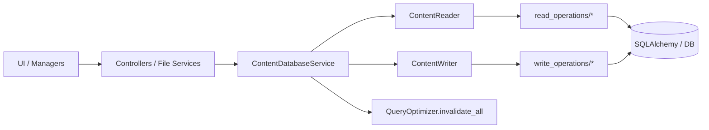
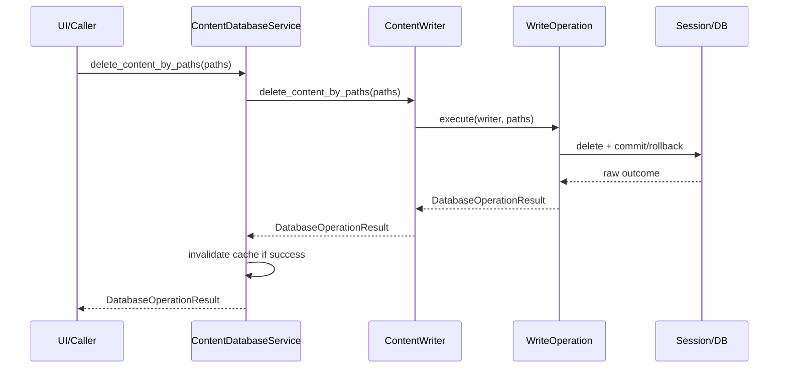

# Database Services V1.6.0

Ce document standardise l'architecture et les contrats des services base de données (`services/database`) après la refonte V1.6.0.

## 1. Objectif

- clarifier le rôle de la façade `ContentDatabaseService` ;
- expliciter les contrats read vs write ;
- standardiser les mutations UI-facing via `DatabaseOperationResult` ;
- documenter la structure modulaire `read_operations` / `write_operations`.

## 2. Contrat de résultat

### 2.1 Mutations (contrat structuré)

Toutes les mutations exposées à la UI retournent :

```python
@dataclass
class DatabaseOperationResult:
    success: bool
    code: DatabaseOperationCode
    message: str
    data: dict[str, Any] = field(default_factory=dict)
```

Codes utilisés :

- `ok`
- `invalid_input`
- `not_found`
- `partial_success`
- `db_error`
- `unknown_error`

### 2.2 Lectures (contrat public unifié)

- `ContentReader` retourne `DatabaseOperationResult` pour les lectures (`data.items`, `data.count`, `data.statistics`, etc.).
- `ContentDatabaseService` expose désormais ce même contrat structuré en lecture.
- Comportement précédent (avant refonte) : la façade déballait `result.data` et retournait des valeurs brutes (`list`/`dict`/`int`/`Optional[item]`) ; ce comportement a été retiré en V1.6.0 (voir `CHANGELOG.md`).

## 3. Clés `data` canoniques

Clés standardisées pour `DatabaseOperationResult.data` :

- `deleted_count`
- `ignored_count`
- `failed_ids`
- `failed_paths`
- `normalized_paths`
- `error`

Clés additionnelles selon opération :

- `item`
- `items`
- `saved_count`
- `updated_count`
- `created`

## 4. Catalogue des opérations

| Kind/Action | Méthode façade | Rôle principal | Clés `data` attendues |
| --- | --- | --- | --- |
| `read_list` | `find_items(...)` | Recherche filtrée/sort/pagination | `items`/`error` |
| `read_count` | `count_all_items(...)` | Compte global | `count`/`error` |
| `read_pending_metadata` | `get_items_pending_metadata(...)` | Items sans metadata extraite | `items`/`error` |
| `read_duplicates` | `find_duplicates(...)` | Groupes de doublons par hash | `duplicates`/`error` |
| `read_stats` | `get_statistics(...)` | Statistiques DB | `statistics`/`error` |
| `read_by_path` | `get_content_by_path(path)` | Résolution par path | `item`/`error` |
| `read_uncategorized` | `get_uncategorized_items(...)` | Items sans catégorie | `items`/`error` |
| `read_unique_categories` | `get_unique_categories(...)` | Valeurs filtres catégorie | `categories`/`error` |
| `read_unique_years` | `get_unique_years(...)` | Valeurs filtres année | `years`/`error` |
| `read_unique_extensions` | `get_unique_extensions(...)` | Valeurs filtres extension | `extensions`/`error` |
| `write_create` | `create_content_item(...)` | Création/upsert item | succès: `item`, `created`; échec: `error` |
| `write_save_batch` | `save_item_batch(...)` | Upsert batch | `items`, `saved_count`, `ignored_count`, `failed_paths`, `normalized_paths` |
| `write_update_metadata_batch` | `update_metadata_batch(...)` | MAJ metadata batch | `updated_count`, `items`, `ignored_count`, `failed_ids` |
| `write_update_category` | `update_content_category(...)` | Affectation catégorie | succès: `item`; échec: `failed_paths`/`error` |
| `write_clear_category` | `clear_content_category(...)` | Suppression catégorie | succès: `item`; échec: `failed_paths`/`error` |
| `write_clear_all` | `clear_all_content(...)` | Purge DB contenu | `deleted_count`/`error` |
| `write_delete_by_paths` | `delete_content_by_paths(...)` | Suppression batch par paths | `deleted_count`, `ignored_count`, `failed_paths`, `normalized_paths`, `error` |

### 4.1 Cas particuliers

- `force_database_sync()` reste une méthode façade utilitaire (WAL checkpoint) ;
- invalidation cache centralisée dans `ContentDatabaseService` (`_invalidate_on_success`) ;
- plus de shim legacy `services/content_database_service.py` ;
- plus de split legacy `core/` et `operations/` (remplacé par `query_optimizer.py`, `read_operations/`, `write_operations/`).

### 4.2 Sémantique de `partial_success`

- `partial_success` est effectivement émis par :
  - `save_item_batch(...)` quand seule une partie des entrées est persistée (`ignored_count > 0` et/ou `failed_paths` non vide).
  - `update_metadata_batch(...)` quand au moins un item est mis à jour mais que certains ids cibles sont absents (`failed_ids` non vide).
  - `delete_content_by_paths(...)` quand certains paths normalisés ne correspondent à aucune ligne (`ignored_count > 0`).
- Ce code n’est donc pas « réservé pour plus tard » ; les appelants doivent le traiter comme un succès partiel et exploiter les détails dans `data`.

## 5. Rôle des couches

- `ContentDatabaseService` :
  - orchestration read/write ;
  - délégation vers `ContentReader`/`ContentWriter` ;
  - invalidation cache après mutation réussie.
- `ContentReader` :
  - façade lecture mince ;
  - délégation vers `read_operations` ;
  - retour structuré `DatabaseOperationResult`.
- `ContentWriter` :
  - façade mutation mince ;
  - délégation vers `write_operations` ;
  - contrat mutation unifié.
- `read_operations` / `write_operations` :
  - logique unitaire métier/SQLAlchemy ;
  - construction des payloads.
- UI/Managers/Controllers :
  - consommation des retours ;
  - mapping message/code côté UX.

### 5.1 Convention de gestion d’erreur côté appelants (read)

- `not_found` : absence attendue ; éviter d’afficher une erreur bloquante si un fallback métier existe.
- `db_error` / `unknown_error` : échec de lecture ; logger `code` + `message` puis appliquer un fallback explicite (`[]`, `{}`, `None`, ou snapshot mémoire conservé) selon le contexte.
- `partial_success` : succès avec résultat incomplet ; exploiter les compteurs/listes de `data` (`ignored_count`, `failed_*`) pour l’UI/le reporting si pertinent.
- Dans les flux UI, privilégier un message utilisateur explicite uniquement pour les erreurs actionnables (ex: impossible de charger les options de filtre), pas pour un résultat vide normal.

## 6. Cartographie exacte (qui utilise quoi)

### 6.1 Appelants -> façade

Ce tableau est volontairement non exhaustif ; il recense les appelants principaux/à fort trafic, pas l’intégralité des call-sites.

| Appelant | Méthodes utilisées (exemples) | Fichier |
| --- | --- | --- |
| `CategorizationController` | `find_duplicates`, `get_content_by_path`, `update_content_category` | `src/ai_content_classifier/controllers/categorization_controller.py` |
| `FileOperationService` + opérations | `find_items`, `count_all_items`, `force_database_sync`, `delete_content_by_paths` | `src/ai_content_classifier/services/file/` |
| `FilePresenter` | `get_content_by_path`, `clear_content_category`, `find_items` | `src/ai_content_classifier/views/presenters/file_presenter.py` |
| `FileManager` | `clear_all_content` | `src/ai_content_classifier/views/managers/file_manager.py` |
| `UIEventHandler` | `get_unique_categories`, `get_unique_years`, `get_unique_extensions` | `src/ai_content_classifier/views/handlers/ui_event_handler.py` |
| `ScanPipelineService` | `get_content_by_path`, `create_content_item` | `src/ai_content_classifier/services/file/scan_pipeline_service.py` |

### 6.2 Façade -> sous-composants

| Méthode façade | Cible appelée |
| --- | --- |
| `find_items` | `ContentReader.find_items` -> `FindItemsOperation.execute` |
| `count_all_items` | `ContentReader.count_all_items` -> `CountAllItemsOperation.execute` |
| `get_items_pending_metadata` | `GetItemsPendingMetadataOperation.execute` |
| `find_duplicates` | `FindDuplicatesOperation.execute` |
| `get_statistics` | `GetStatisticsOperation.execute` |
| `get_content_by_path` | `GetContentByPathOperation.execute` |
| `get_uncategorized_items` | `GetUncategorizedItemsOperation.execute` |
| `get_unique_categories` | `GetUniqueCategoriesOperation.execute` |
| `get_unique_years` | `GetUniqueYearsOperation.execute` |
| `get_unique_extensions` | `GetUniqueExtensionsOperation.execute` |
| `create_content_item` | `CreateContentItemOperation.execute` |
| `save_item_batch` | `SaveItemBatchOperation.execute` |
| `update_metadata_batch` | `UpdateMetadataBatchOperation.execute` |
| `update_content_category` | `UpdateContentCategoryOperation.execute` |
| `clear_content_category` | `ClearContentCategoryOperation.execute` |
| `clear_all_content` | `ClearAllContentOperation.execute` |
| `delete_content_by_paths` | `DeleteContentByPathsOperation.execute` |

### 6.3 Dette technique explicite

- `TODO(DB-OPS-SPLIT-PHASE2)`: réduire davantage `ContentReader`/`ContentWriter` en extractant des helpers privés volumineux si besoin.

## 7. Schéma Mermaid (liens UI/Controller -> service)



## 8. Schéma Mermaid (séquence type)



## 9. Convention d'évolution

- toute nouvelle opération DB passe par `ContentDatabaseService` ;
- toute mutation UI-facing retourne `DatabaseOperationResult` ;
- toute nouvelle clé `data` doit être canonique et documentée ici ;
  processus de proposition : introduire la clé dans la PR d’implémentation, la documenter dans ce fichier, puis la valider en review PR par les mainteneurs/reviewers DB avant merge ;
- tout changement cassant de contrat doit être versionné (`CHANGELOG.md`) et migré côté call-sites.

## 10. Versionner le service

Convention projet :

- `Vx.y.0` : stabilisation/correctifs ;
- `Vx.y.1` : refonte contrat / simplification architecture ;
- `Vx.y.2` : extraction responsabilités / extensibilité.

Pour chaque version documenter :

- objectifs ;
- changements de contrat ;
- impacts appelants ;
- migrations ;
- non-régressions validées.

## 11. Checklist qualité du document

- [x] Objectif et périmètre définis.
- [x] Contrat de résultat explicite pour les écritures et lectures.
- [x] Clés `data` canoniques listées.
- [x] Catalogue des opérations complété.
- [x] Cartographie des dépendances renseignée.
- [x] Cas particuliers/dettes techniques documentés.
- [x] Schémas Mermaid présents et lisibles.
- [x] Convention d'évolution et versioning définis.
