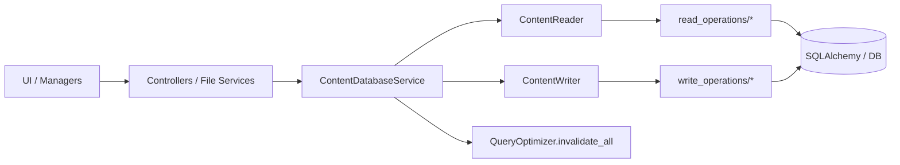
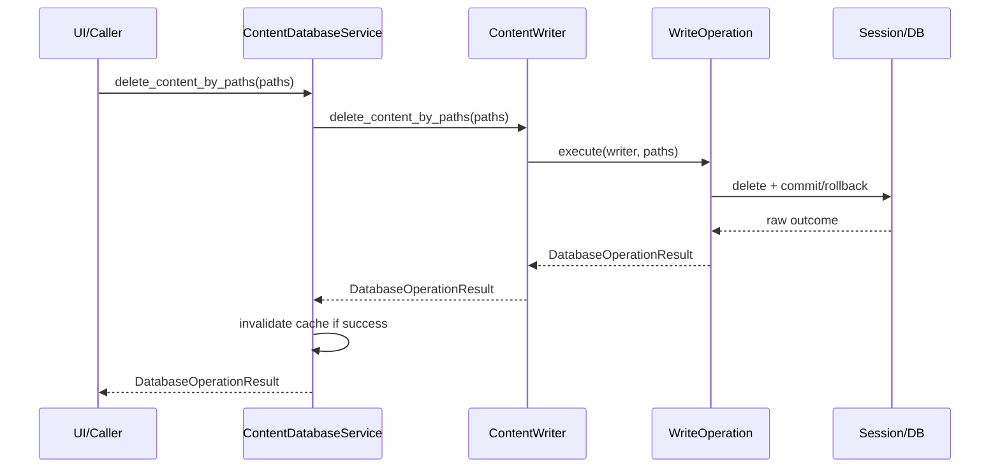

# Database Services V1.6.0

This document standardizes the architecture and contracts of database services (`services/database`) after the V1.6.0 refactor.

## 1. Objective

- clarify the role of the `ContentDatabaseService` facade;
- make read vs write contracts explicit;
- standardize UI-facing mutations through `DatabaseOperationResult`;
- document the modular structure: `read_operations` / `write_operations`.

## 2. Result contract

### 2.1 Mutations (structured contract)

All mutations exposed to the UI return:

```python
@dataclass
class DatabaseOperationResult:
    success: bool
    code: DatabaseOperationCode
    message: str
    data: dict[str, Any] = field(default_factory=dict)
```

Codes used:

- `ok`
- `invalid_input`
- `not_found`
- `partial_success`
- `db_error`
- `unknown_error`

### 2.2 Reads (unified public contract)

- `ContentReader` returns `DatabaseOperationResult` for reads (`data.items`, `data.count`, `data.statistics`, etc.).
- `ContentDatabaseService` now exposes the same structured read contract directly.
- Prior behavior (pre-refactor): the facade unpacked `result.data` and returned raw values (`list`/`dict`/`int`/`Optional[item]`); this was removed in V1.6.0 (see `CHANGELOG.md`).

## 3. Canonical `data` keys

Standardized keys for `DatabaseOperationResult.data`:

- `deleted_count`
- `ignored_count`
- `failed_ids`
- `failed_paths`
- `normalized_paths`
- `error`

Additional keys depending on the operation:

- `item`
- `items`
- `saved_count`
- `updated_count`
- `created`

## 4. Operation catalog

| Kind/Action | Facade method | Main role | Expected `data` keys |
| --- | --- | --- | --- |
| `read_list` | `find_items(...)` | Filtered search/sort/pagination | `items`/`error` |
| `read_count` | `count_all_items(...)` | Global count | `count`/`error` |
| `read_pending_metadata` | `get_items_pending_metadata(...)` | Items without extracted metadata | `items`/`error` |
| `read_duplicates` | `find_duplicates(...)` | Duplicate groups by hash | `duplicates`/`error` |
| `read_stats` | `get_statistics(...)` | DB statistics | `statistics`/`error` |
| `read_by_path` | `get_content_by_path(path)` | Resolve by path | `item`/`error` |
| `read_uncategorized` | `get_uncategorized_items(...)` | Items without category | `items`/`error` |
| `read_unique_categories` | `get_unique_categories(...)` | Category filter values | `categories`/`error` |
| `read_unique_years` | `get_unique_years(...)` | Year filter values | `years`/`error` |
| `read_unique_extensions` | `get_unique_extensions(...)` | Extension filter values | `extensions`/`error` |
| `write_create` | `create_content_item(...)` | Create/upsert item | success: `item`, `created`; failure: `error` |
| `write_save_batch` | `save_item_batch(...)` | Batch upsert | `items`, `saved_count`, `ignored_count`, `failed_paths`, `normalized_paths` |
| `write_update_metadata_batch` | `update_metadata_batch(...)` | Batch metadata update | `updated_count`, `items`, `ignored_count`, `failed_ids` |
| `write_update_category` | `update_content_category(...)` | Category assignment | success: `item`; failure: `failed_paths`/`error` |
| `write_clear_category` | `clear_content_category(...)` | Category removal | success: `item`; failure: `failed_paths`/`error` |
| `write_clear_all` | `clear_all_content(...)` | Content DB purge | `deleted_count`/`error` |
| `write_delete_by_paths` | `delete_content_by_paths(...)` | Batch deletion by paths | `deleted_count`, `ignored_count`, `failed_paths`, `normalized_paths`, `error` |

### 4.1 Special cases

- `force_database_sync()` remains a utility facade method (WAL checkpoint);
- cache invalidation is centralized in `ContentDatabaseService` (`_invalidate_on_success`);
- no more legacy shim `services/content_database_service.py`;
- no more legacy split `core/` and `operations/` (replaced by `query_optimizer.py`, `read_operations/`, `write_operations/`).

### 4.2 `partial_success` semantics

- `partial_success` is actively emitted by:
  - `save_item_batch(...)` when only a subset of inputs is persisted (`ignored_count > 0` and/or `failed_paths` non-empty).
  - `update_metadata_batch(...)` when at least one item is updated but some target ids are missing (`failed_ids` non-empty).
  - `delete_content_by_paths(...)` when some normalized paths do not match any row (`ignored_count > 0`).
- It is not a reserved-only future code; callers should handle it as a successful operation with partial outcome details in `data`.

## 5. Layer responsibilities

- `ContentDatabaseService`:
  - read/write orchestration;
  - delegation to `ContentReader`/`ContentWriter`;
  - cache invalidation after successful mutation.
- `ContentReader`:
  - thin read facade;
  - delegation to `read_operations`;
  - structured `DatabaseOperationResult` return.
- `ContentWriter`:
  - thin mutation facade;
  - delegation to `write_operations`;
  - unified mutation contract.
- `read_operations` / `write_operations`:
  - unit business logic/SQLAlchemy;
  - payload construction.
- UI/Managers/Controllers:
  - return consumption;
  - UX-side message/code mapping.

### 5.1 Caller-side read error handling convention

- `not_found`: treat as expected absence; avoid surfacing a blocking error to users when fallback behavior exists.
- `db_error` / `unknown_error`: treat as read failure; log `code` + `message` and apply an explicit fallback (`[]`, `{}`, `None`, or preserved in-memory snapshot) depending on context.
- `partial_success`: treat as success, but use `data` counters/lists (`ignored_count`, `failed_*`) to inform UI/reporting when relevant.
- For UI-facing flows, prefer explicit user feedback only for actionable failures (e.g., unable to load filter options), not for normal empty results.

## 6. Exact mapping (who uses what)

### 6.1 Callers -> facade

This table is non-exhaustive by design; it lists the main/high-traffic callers, not every call site in the codebase.

| Caller | Methods used (examples) | File |
| --- | --- | --- |
| `CategorizationController` | `find_duplicates`, `get_content_by_path`, `update_content_category` | `src/ai_content_classifier/controllers/categorization_controller.py` |
| `FileOperationService` + operations | `find_items`, `count_all_items`, `force_database_sync`, `delete_content_by_paths` | `src/ai_content_classifier/services/file/` |
| `FilePresenter` | `get_content_by_path`, `clear_content_category`, `find_items` | `src/ai_content_classifier/views/presenters/file_presenter.py` |
| `FileManager` | `clear_all_content` | `src/ai_content_classifier/views/managers/file_manager.py` |
| `UIEventHandler` | `get_unique_categories`, `get_unique_years`, `get_unique_extensions` | `src/ai_content_classifier/views/handlers/ui_event_handler.py` |
| `ScanPipelineService` | `get_content_by_path`, `create_content_item` | `src/ai_content_classifier/services/file/scan_pipeline_service.py` |

### 6.2 Facade -> sub-components

| Facade method | Called target |
| --- | --- |
| `find_items` | `ContentReader.find_items` -> `FindItemsOperation.execute` |
| `count_all_items` | `ContentReader.count_all_items` -> `CountAllItemsOperation.execute` |
| `get_items_pending_metadata` | `GetItemsPendingMetadataOperation.execute` |
| `find_duplicates` | `FindDuplicatesOperation.execute` |
| `get_statistics` | `GetStatisticsOperation.execute` |
| `get_content_by_path` | `GetContentByPathOperation.execute` |
| `get_uncategorized_items` | `GetUncategorizedItemsOperation.execute` |
| `get_unique_categories` | `GetUniqueCategoriesOperation.execute` |
| `get_unique_years` | `GetUniqueYearsOperation.execute` |
| `get_unique_extensions` | `GetUniqueExtensionsOperation.execute` |
| `create_content_item` | `CreateContentItemOperation.execute` |
| `save_item_batch` | `SaveItemBatchOperation.execute` |
| `update_metadata_batch` | `UpdateMetadataBatchOperation.execute` |
| `update_content_category` | `UpdateContentCategoryOperation.execute` |
| `clear_content_category` | `ClearContentCategoryOperation.execute` |
| `clear_all_content` | `ClearAllContentOperation.execute` |
| `delete_content_by_paths` | `DeleteContentByPathsOperation.execute` |

### 6.3 Explicit technical debt

- `TODO(DB-OPS-SPLIT-PHASE2)`: further slim down `ContentReader`/`ContentWriter` by extracting large private helpers if needed.

## 7. Mermaid diagram (UI/Controller -> service links)



## 8. Mermaid diagram (typical sequence)



## 9. Evolution convention

- every new DB operation goes through `ContentDatabaseService`;
- every UI-facing mutation returns `DatabaseOperationResult`;
- every new `data` key must be canonical and documented here;
  proposal process: introduce the key in the implementation PR, document it in this file, and validate/approve it during PR review by DB-service maintainers/reviewers before merge.
- every breaking contract change must be versioned (`CHANGELOG.md`) and migrated at call sites.

## 10. Service versioning

Project convention:

- `Vx.y.0` : stabilization/fixes;
- `Vx.y.1` : contract refactor / architecture simplification;
- `Vx.y.2` : responsibility extraction / extensibility.

For each version document:

- objectives;
- contract changes;
- caller impacts;
- migrations;
- validated non-regressions.

## 11. Document quality checklist

- [x] Objective and scope defined.
- [x] Explicit result contract for both writes and reads.
- [x] Canonical `data` keys listed.
- [x] Operation catalog completed.
- [x] Dependency mapping documented.
- [x] Special cases/technical debt documented.
- [x] Mermaid diagrams present and readable.
- [x] Evolution and versioning conventions defined.
