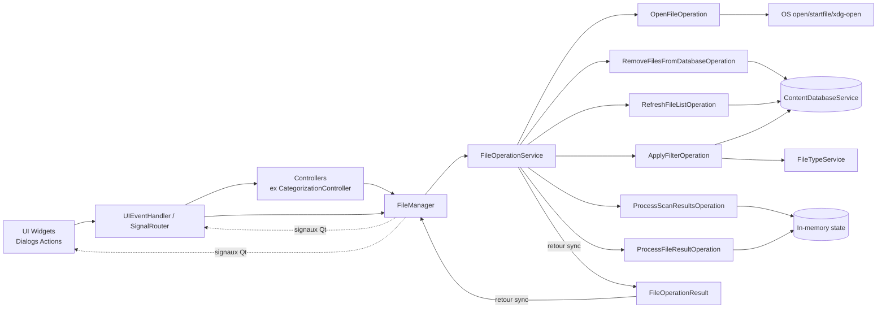
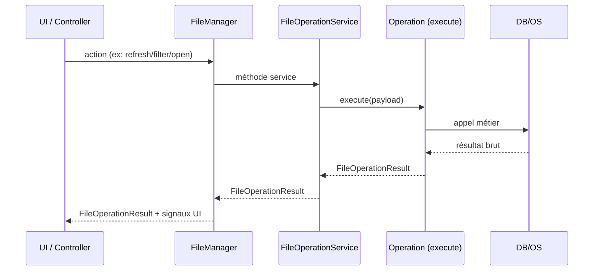

# File Operations V1.1 (Draft)

Ce document décrit l'architecture des opérations fichier et le contrat de retour unifié basé sur `FileOperationResult`.

Version du service documenté : `V1.1`  
Introduit dans la release produit : `Javis v1.4.0`

## 1. Objectif

- éviter un `FileOperationService` monolithique ;
- isoler chaque responsabilité dans une classe d'opération dédiée ;
- standardiser les retours pour simplifier le traitement par `FileManager`, controllers et UI.

## 2. Contrat de résultat

Toutes les opérations exposées par `FileOperationService` et `FileManager` remontent un `FileOperationResult` :

```python
@dataclass
class FileOperationResult:
    success: bool
    code: FileOperationCode
    message: str
    data: dict[str, Any] = field(default_factory=dict)
```

Codes actuels (`FileOperationCode`) :

- `ok`
- `file_not_found`
- `no_default_app`
- `access_denied`
- `unknown_error`

## 3. Clés `data` canoniques

Les payloads dans `data` utilisent des clés standardisées (`FileOperationDataKey`) :

- `file_list`
- `content_by_path`
- `files_found`
- `filtered_files`
- `deleted_count`
- `normalized_paths`
- `file_processing_result`
- `error`

## 4. Catalogue des opérations

Les opérations sont implémentées dans `src/ai_content_classifier/services/file/operations/`.

| Kind (`FileOperationKind`) | Classe | Rôle principal | Clés `data` attendues (exhaustif) |
| --- | --- | --- | --- |
| `open_file` | `OpenFileOperation` | Ouvrir un fichier via app par défaut OS | succès: `path` ; échec: `path`, `error` ; échec commande OS: `path`, `command`, `return_code`, `stdout`, `stderr` |
| `remove_from_database` | `RemoveFilesFromDatabaseOperation` | Supprimer des entrées DB uniquement | succès: `deleted_count`, `normalized_paths` ; échec: `error` |
| `refresh_file_list` | `RefreshFileListOperation` | Recharger la liste depuis la DB | succès: `file_list`, `content_by_path` ; échec: `file_list`, `content_by_path`, `error` |
| `apply_filter` | `ApplyFilterOperation` | Appliquer un filtre de type | succès: `filtered_files` ; échec: `filtered_files`, `error` |
| `process_scan_results` | `ProcessScanResultsOperation` | Normaliser sortie scan + stats | succès: `file_list`, `content_by_path`, `files_found` ; échec: `file_list`, `error` |
| `process_file_result` | `ProcessFileResultOperation` | Mettre à jour stats de traitement fichier | succès: `file_processing_result` ; échec: `error` |

### 4.1 Cas particulier des `FilterType` spéciaux

Les `FilterType` suivants ne passent pas par `ApplyFilterOperation` :

- `MULTI_CATEGORY`
- `MULTI_YEAR`
- `MULTI_EXTENSION`

Ils sont traités via les méthodes dédiées du service (`FileOperationService`) :

- `apply_multi_category_filter_to_list(...)`
- `apply_multi_year_filter_to_list(...)`
- `apply_multi_extension_filter_to_list(...)`

Leur résultat est ensuite intégré dans le flux cumulatif de `FileManager` (`_apply_cumulative_filters`).

## 5. Rôle des couches

- `FileManager` :
  - interface Qt consommée par handlers/controllers ;
  - retourne des `FileOperationResult` ;
  - émet signaux UI (`files_updated`, `filter_applied`, etc.).

- `FileOperationService` :
  - façade d'orchestration ;
  - délègue à chaque opération (`execute(...)`) ;
  - applique les callbacks transverses et maintient l'état interne.

- `*Operation` :
  - logique métier unitaire par responsabilité ;
  - entrée simple, sortie `FileOperationResult`.

### 5.1 Callbacks du `FileOperationService` (contrat observable)

Callbacks configurés via `set_callbacks(...)` :

- `on_scan_started(directory: str)`
- `on_scan_progress(progress: Any)`
- `on_scan_completed(file_list: list[tuple[str, str]])`
- `on_scan_error(error_message: str)`
- `on_file_processed(result: FileProcessingResult)`
- `on_files_updated(file_list: list[tuple[str, str]])`
- `on_filter_applied(filter_type: FilterType, filtered_files: list[tuple[str, str]])`
- `on_stats_updated(stats: ScanStatistics)`

## 6. Cartographie exacte (qui utilise quoi)

### 6.1 Appelants -> `FileManager`

| Appelant | Méthode `FileManager` utilisée | Localisation actuelle |
| --- | --- | --- |
| `UIEventHandler` | `apply_filter(...)` | `src/ai_content_classifier/views/handlers/ui_event_handler.py` |
| `UIEventHandler` | `remove_files_from_database(...)` | `src/ai_content_classifier/views/handlers/ui_event_handler.py` |
| `SignalRouter` | `refresh_file_list()` | `src/ai_content_classifier/views/handlers/signal_router.py` |
| `MainView` | `refresh_file_list()` | `src/ai_content_classifier/views/main_view.py` |
| `MainWindow` (handler par défaut) | `refresh_file_list()` | `src/ai_content_classifier/views/main_window/main.py` |
| `CategorizationController` | `refresh_file_list()` | `src/ai_content_classifier/controllers/categorization_controller.py` |
| `FilePresenter` | `refresh_and_emit_visible_files()` | `src/ai_content_classifier/views/presenters/file_presenter.py` |

### 6.2 `FileManager` -> `FileOperationService`

| Méthode `FileManager` | Méthode `FileOperationService` appelée |
| --- | --- |
| `apply_filter(...)` | `apply_filter(...)` |
| `_apply_cumulative_filters()` | `refresh_file_list()` |
| `refresh_file_list()` | `refresh_file_list()` |
| `refresh_and_emit_visible_files()` | `refresh_file_list()` |
| `remove_files_from_database(...)` | `remove_files_from_database(...)` |
| `_on_scan_completed(...)` | `process_scan_results(...)` |
| `_on_file_processed(...)` | `process_file_result(...)` |

### 6.3 `FileOperationService` -> classes d’opérations

| Méthode `FileOperationService` | Opération déléguée |
| --- | --- |
| `open_file(...)` | `OpenFileOperation.execute(...)` |
| `remove_files_from_database(...)` | `RemoveFilesFromDatabaseOperation.execute(...)` |
| `refresh_file_list()` | `RefreshFileListOperation.execute(...)` |
| `apply_filter(...)` | `ApplyFilterOperation.execute(...)` |
| `process_scan_results(...)` | `ProcessScanResultsOperation.execute(...)` |
| `process_file_result(...)` | `ProcessFileResultOperation.execute(...)` |

### 6.4 Cas particulier actuel: "Open file" depuis la vue détail

Le flux "Open file" est aujourd'hui câblé ainsi :

`FileDetailsDialog.open_file_requested` -> `FilePresenter._on_open_file_requested` -> `main_window.file_manager.file_service.open_file(...)`

Ce point contourne `FileManager` comme façade publique. C'est fonctionnel mais on peut le réaligner plus tard vers `FileManager` pour homogénéiser tous les appels.

Dette technique explicitée :

- `TODO(FILEOPS-OPENFILE-ROUTING)`: faire passer l'action "Open file" par `FileManager.open_file(...)` (au lieu d'un accès direct `file_manager.file_service.open_file(...)`) pour aligner la frontière d'API.

## 7. Schéma Mermaid (liens UI/Controller -> opérations)



## 8. Schéma Mermaid (séquence type)



## 9. Convention d'évolution

- toute nouvelle opération fichier :
  - doit avoir une classe dédiée `*Operation` ;
  - doit implémenter `execute(...) -> FileOperationResult` ;
  - doit utiliser les clés `FileOperationDataKey` ;
  - doit être branchée via `FileOperationService`.

## 10. Versionner le service

- version actuelle du service : `V1.1`
- release d'introduction dans Javis : `v1.4.0`
