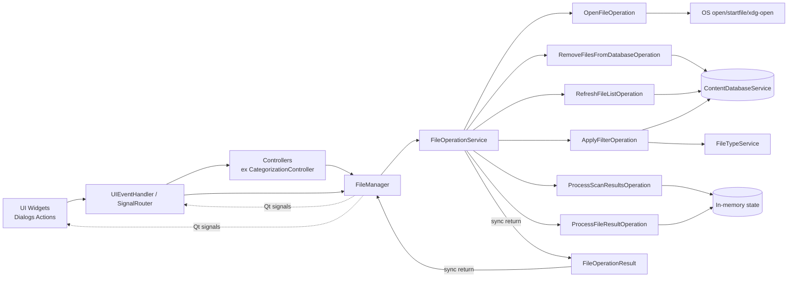
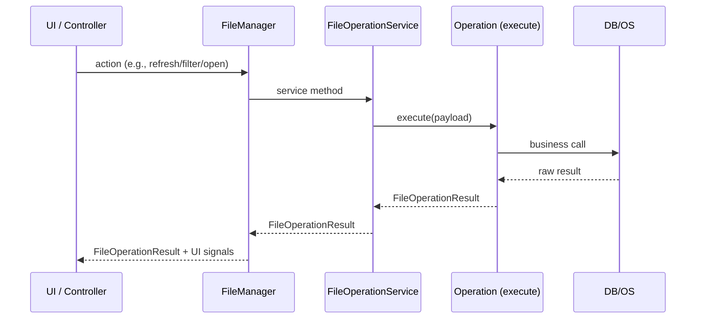

# File Operations V1 (Draft)

This document describes the file operations architecture and the unified return contract based on `FileOperationResult`.

## 1. Goal

- avoid a monolithic `FileOperationService`;
- isolate each responsibility in a dedicated operation class;
- standardize return values to simplify handling by `FileManager`, controllers, and UI.

## 2. Result Contract

All operations exposed by `FileOperationService` and `FileManager` return a `FileOperationResult`:

```python
@dataclass
class FileOperationResult:
    success: bool
    code: FileOperationCode
    message: str
    data: dict[str, Any] = field(default_factory=dict)
```

Current codes (`FileOperationCode`):

- `ok`
- `file_not_found`
- `no_default_app`
- `access_denied`
- `unknown_error`

## 3. Canonical `data` Keys

Payloads in `data` use standardized keys (`FileOperationDataKey`):

- `file_list`
- `content_by_path`
- `files_found`
- `filtered_files`
- `deleted_count`
- `normalized_paths`
- `file_processing_result`
- `error`

## 4. Operation Catalog

Operations are implemented in `src/ai_content_classifier/services/file/operations/`.

| Kind (`FileOperationKind`) | Class | Main role | Expected `data` keys (exhaustive) |
| --- | --- | --- | --- |
| `open_file` | `OpenFileOperation` | Open a file using the OS default app | success: `path`; failure: `path`, `error`; OS command failure: `path`, `command`, `return_code`, `stdout`, `stderr` |
| `remove_from_database` | `RemoveFilesFromDatabaseOperation` | Remove DB entries only | success: `deleted_count`, `normalized_paths`; failure: `error` |
| `refresh_file_list` | `RefreshFileListOperation` | Reload file list from DB | success: `file_list`, `content_by_path`; failure: `file_list`, `content_by_path`, `error` |
| `apply_filter` | `ApplyFilterOperation` | Apply a type filter | success: `filtered_files`; failure: `filtered_files`, `error` |
| `process_scan_results` | `ProcessScanResultsOperation` | Normalize scan output + stats | success: `file_list`, `content_by_path`, `files_found`; failure: `file_list`, `error` |
| `process_file_result` | `ProcessFileResultOperation` | Update file processing stats | success: `file_processing_result`; failure: `error` |

### 4.1 Special Case: Special `FilterType` Values

The following `FilterType` values do not go through `ApplyFilterOperation`:

- `MULTI_CATEGORY`
- `MULTI_YEAR`
- `MULTI_EXTENSION`

They are handled through dedicated service methods (`FileOperationService`):

- `apply_multi_category_filter_to_list(...)`
- `apply_multi_year_filter_to_list(...)`
- `apply_multi_extension_filter_to_list(...)`

Their result is then integrated into `FileManager`'s cumulative flow (`_apply_cumulative_filters`).

## 5. Layer Responsibilities

- `FileManager`:
  - Qt-facing interface used by handlers/controllers;
  - returns `FileOperationResult` values;
  - emits UI signals (`files_updated`, `filter_applied`, etc.).

- `FileOperationService`:
  - orchestration facade;
  - delegates to operations (`execute(...)`);
  - applies cross-cutting callbacks and maintains internal state.

- `*Operation`:
  - single-responsibility business logic;
  - simple input, `FileOperationResult` output.

### 5.1 `FileOperationService` Callbacks (Observable Contract)

Callbacks configured through `set_callbacks(...)`:

- `on_scan_started(directory: str)`
- `on_scan_progress(progress: Any)`
- `on_scan_completed(file_list: list[tuple[str, str]])`
- `on_scan_error(error_message: str)`
- `on_file_processed(result: FileProcessingResult)`
- `on_files_updated(file_list: list[tuple[str, str]])`
- `on_filter_applied(filter_type: FilterType, filtered_files: list[tuple[str, str]])`
- `on_stats_updated(stats: ScanStatistics)`

## 6. Exact Mapping (Who Uses What)

### 6.1 Callers -> `FileManager`

| Caller | `FileManager` method used | Current location |
| --- | --- | --- |
| `UIEventHandler` | `apply_filter(...)` | `src/ai_content_classifier/views/handlers/ui_event_handler.py` |
| `UIEventHandler` | `remove_files_from_database(...)` | `src/ai_content_classifier/views/handlers/ui_event_handler.py` |
| `SignalRouter` | `refresh_file_list()` | `src/ai_content_classifier/views/handlers/signal_router.py` |
| `MainView` | `refresh_file_list()` | `src/ai_content_classifier/views/main_view.py` |
| `MainWindow` (default handler) | `refresh_file_list()` | `src/ai_content_classifier/views/main_window/main.py` |
| `CategorizationController` | `refresh_file_list()` | `src/ai_content_classifier/controllers/categorization_controller.py` |
| `FilePresenter` | `refresh_and_emit_visible_files()` | `src/ai_content_classifier/views/presenters/file_presenter.py` |

### 6.2 `FileManager` -> `FileOperationService`

| `FileManager` method | Called `FileOperationService` method |
| --- | --- |
| `apply_filter(...)` | `apply_filter(...)` |
| `_apply_cumulative_filters()` | `refresh_file_list()` |
| `refresh_file_list()` | `refresh_file_list()` |
| `refresh_and_emit_visible_files()` | `refresh_file_list()` |
| `remove_files_from_database(...)` | `remove_files_from_database(...)` |
| `_on_scan_completed(...)` | `process_scan_results(...)` |
| `_on_file_processed(...)` | `process_file_result(...)` |

### 6.3 `FileOperationService` -> Operation Classes

| `FileOperationService` method | Delegated operation |
| --- | --- |
| `open_file(...)` | `OpenFileOperation.execute(...)` |
| `remove_files_from_database(...)` | `RemoveFilesFromDatabaseOperation.execute(...)` |
| `refresh_file_list()` | `RefreshFileListOperation.execute(...)` |
| `apply_filter(...)` | `ApplyFilterOperation.execute(...)` |
| `process_scan_results(...)` | `ProcessScanResultsOperation.execute(...)` |
| `process_file_result(...)` | `ProcessFileResultOperation.execute(...)` |

### 6.4 Current Special Case: "Open file" from file details

The current "Open file" flow is wired as:

`FileDetailsDialog.open_file_requested` -> `FilePresenter._on_open_file_requested` -> `main_window.file_manager.file_service.open_file(...)`

This bypasses `FileManager` as the public facade. It works, but can be realigned later through `FileManager` for full API consistency.

Explicit technical debt:

- `TODO(FILEOPS-OPENFILE-ROUTING)`: route the "Open file" action through `FileManager.open_file(...)` (instead of direct `file_manager.file_service.open_file(...)`) to align API boundaries.

## 7. Mermaid Diagram (UI/Controller links -> operations)



## 8. Mermaid Diagram (Typical Sequence)



## 9. Evolution Convention

- any new file operation:
  - must have a dedicated `*Operation` class;
  - must implement `execute(...) -> FileOperationResult`;
  - must use `FileOperationDataKey` keys;
  - must be wired through `FileOperationService`.
