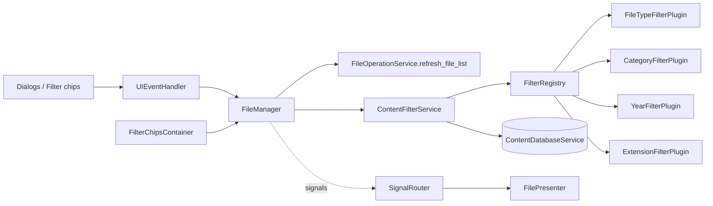
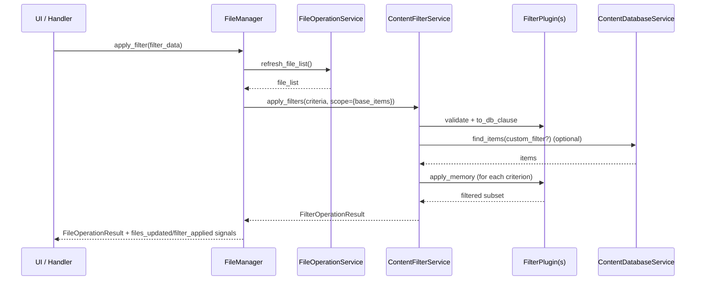

# Operation de Filtrage V1 (Brouillon)

Ce document decrit l'architecture de filtrage centree sur `ContentFilterService` et son pipeline de plugins (`file_type`, `category`, `year`, `extension`).

Note (V1.7) : la responsabilite du filtrage a ete extraite de `FileOperationService` et est maintenant geree par `services/filtering/ContentFilterService`.

## 1. Objectif

- fournir une facade unique de filtrage avec un comportement logique cumulatif en `AND` ;
- separer chaque critere dans des plugins dedies ;
- prendre en charge un filtrage hybride :
  - push-down DB quand possible (`file_type`, `category`) ;
  - filtrage en memoire si necessaire (`year`, `extension`, plus passage final pour tous les plugins) ;
- conserver un contrat appelant stable (`FilterOperationResult`) quel que soit l'interne des plugins.

## 2. Contrat de Resultat

`ContentFilterService.apply_filters(...)` retourne :

```python
@dataclass
class FilterOperationResult:
    success: bool
    code: FilterOperationCode
    message: str
    data: Dict[str, Any] = field(default_factory=dict)
```

Codes actuels (`FilterOperationCode`) :

- `ok`
- `validation_error`
- `unknown_filter`
- `database_error`
- `unknown_error`

## 3. Cles `data` Canoniques

- `filtered_files` : liste finale des tuples `(path, directory)`
- `applied_filters` : liste normalisee des criteres (`[{key, op, value}, ...]`)
- `error` : `None` en cas de succes, chaine de caracteres en cas d'echec

Regles de comportement :

- aucun critere -> succes + perimetre initial dans `filtered_files` ;
- critere inconnu/invalide -> echec + repli sur le perimetre initial dans `filtered_files` ;
- exception inattendue -> echec `unknown_error` + repli sur le perimetre initial.

## 4. Catalogue des Operations

| Type/Action | Methode | Role principal | Cles `data` attendues |
| --- | --- | --- | --- |
| `apply_filters` | `ContentFilterService.apply_filters(criteria, scope)` | Normalise le perimetre/les criteres, valide les plugins, execute le push-down DB + la chaine memoire | succes : `filtered_files`, `applied_filters`, `error=None` ; echec : `filtered_files`, `applied_filters` (ou `[]`), `error` |
| `register_plugin` | `FilterRegistry.register(plugin)` | Enregistre un plugin par cle unique | aucun payload service (leve `ValueError` si cle vide/dupliquee) |
| `resolve_plugin` | `FilterRegistry.resolve(key)` | Resout un plugin a l'execution | instance de plugin ou `None` |

### 4.1 Catalogue des Plugins par Defaut

| Cle | Operateurs autorises | Push-down DB | Passage memoire | Notes |
| --- | --- | --- | --- | --- |
| `file_type` | `eq`, `in` | oui | oui | alias supportes (`image`/`images`, etc.), support special de `uncategorized` |
| `category` | `eq`, `in` | oui | oui | necessite le contexte `content_map` pendant le passage memoire |
| `year` | `eq`, `in`, `range` | non | oui | resolution multi-source de l'annee : champs modele -> metadonnees -> `mtime` du systeme de fichiers |
| `extension` | `eq`, `in`, `contains` | non | oui | normalise en minuscules avec point prefixe |

### 4.2 Cas Particuliers

- `year` saute volontairement le push-down DB pour preserver le comportement de repli (metadonnees + extraction `mtime`).
- les echecs de lecture DB lors de l'initialisation du dataset declenchent un repli sur le perimetre (log warning), pas un echec dur.
- les echecs d'hydratation du cache par lot dans `_get_content_items_by_path(...)` sont partiels et non fatals.
- quand `allow_db_fallback=False`, les echecs DB sont propages explicitement en `database_error`.

## 5. Responsabilites des Couches

- `FileManager` :
  - gere l'etat UI actif des filtres (`_active_filters`) ;
  - convertit les actions UI/chips en liste de `FilterCriterion` ;
  - appelle la facade de filtrage et emet les signaux Qt (`files_updated`, `filter_applied`).

- `ContentFilterService` :
  - orchestre la normalisation des criteres et l'ordre d'execution des plugins ;
  - agrege les clauses DB et charge le dataset de travail ;
  - fournit le contexte plugin (`content_by_path`, `scope`, `get_content_map`).

- `FilterRegistry` :
  - registre d'execution cle -> plugin ;
  - impose des cles uniques et non vides.

- implementations de `FilterPlugin` :
  - validation au niveau critere ;
  - generation optionnelle de clauses SQLAlchemy ;
  - logique de filtrage en memoire.

## 6. Mapping Exact (Qui Utilise Quoi)

### 6.1 Appelants -> API de Filtrage `FileManager`

| Appelant | Methode utilisee | Fichier |
| --- | --- | --- |
| `UIEventHandler.handle_filter_change(...)` | `file_manager.apply_filter(...)` | `src/ai_content_classifier/views/handlers/ui_event_handler.py` |
| `UIEventHandler.handle_category_filter_request(...)` | `file_manager.apply_filter(...)` | `src/ai_content_classifier/views/handlers/ui_event_handler.py` |
| `UIEventHandler.handle_year_filter_request(...)` | `file_manager.apply_filter(...)` | `src/ai_content_classifier/views/handlers/ui_event_handler.py` |
| `UIEventHandler.handle_extension_filter_request(...)` | `file_manager.apply_filter(...)` | `src/ai_content_classifier/views/handlers/ui_event_handler.py` |
| `UIEventHandler` (action de reinitialisation) | `file_manager.clear_filters()` | `src/ai_content_classifier/views/handlers/ui_event_handler.py` |
| Interaction avec les filter chips | `file_manager.update_filters_from_chips(...)` | `src/ai_content_classifier/views/managers/file_manager.py` |

### 6.2 `FileManager` -> `ContentFilterService`

| Methode `FileManager` | Cible appelee |
| --- | --- |
| `_apply_cumulative_filters()` | `content_filter_service.apply_filters(...)` |
| `_apply_filters_to_file_list(...)` | `content_filter_service.apply_filters(...)` |

### 6.3 `ContentFilterService` -> plugins/DB

| Etape de facade | Cible appelee |
| --- | --- |
| bootstrap par defaut | `_register_default_plugins()` |
| resolution de cle | `registry.resolve(criterion.key)` |
| validation | `plugin.validate(criterion)` |
| construction push-down DB | `plugin.to_db_clause(criterion)` |
| requete dataset initial | `db_service.find_items(...)` |
| passage memoire | `plugin.apply_memory(items, criterion, context)` |
| hydratation a la demande du contenu | `_get_content_items_by_path(...)` -> `db_service.find_items(...)` par lot |

### 6.4 Dette Technique Explicite

- les codes d'erreur de filtrage sont maintenant mappes vers `FileOperationCode` par `FileManager` et `FileOperationService` (`validation_error`, `unknown_filter`, `database_error`).
- `ContentFilterService` emet maintenant explicitement `database_error` quand `allow_db_fallback=False`.

## 7. Diagramme Mermaid (Liens UI/Controller -> Filtrage)



## 8. Diagramme Mermaid (Sequence Type)



## 9. Convention d'Evolution

- toute nouvelle cle de filtre doit etre implementee comme plugin (`validate`, `to_db_clause`, `apply_memory`) ;
- la cle plugin doit etre unique et enregistree via `FilterRegistry` ;
- la sortie de `apply_filters` doit conserver les cles canoniques (`filtered_files`, `applied_filters`, `error`) ;
- le push-down DB est optionnel, mais le comportement en memoire doit rester deterministe ;
- la compatibilite cote appelant doit etre preservee dans `FileManager` (`apply_filter`, `clear_filters`, synchro chips).

## 10. Comment Ajouter un Filtre (Procedure)

Utiliser cette checklist lors de l'introduction d'une nouvelle cle de filtre (par exemple `source_dir`, `date_range`, `size_range`).

1. Implementer un plugin sous `services/filtering/plugins/`
   - creer `<new_key>_filter.py` avec une classe exposant :
   - `key = "<new_key>"`
   - `validate(criterion) -> Optional[str]`
   - `to_db_clause(criterion) -> Optional[List[Any]]`
   - `apply_memory(items, criterion, context) -> List[Tuple[str, str]]`
2. Enregistrer le plugin dans `ContentFilterService._register_default_plugins()`
   - ajouter le plugin dans la liste de bootstrap par defaut.
3. Ajouter le mapping des criteres appelant (UI -> critere)
   - mettre a jour `FileManager._build_filter_criteria()` pour mapper l'etat UI actif vers `FilterCriterion(key, op, value)`.
   - si necessaire, ajouter le flux du selecteur UI dans `UIEventHandler` et le formatage des filter chips dans `FilePresenter`.
4. Valider la compatibilite du contrat d'erreur
   - conserver les cles canoniques de `FilterOperationResult.data` :
   - `filtered_files`, `applied_filters`, `error`.
   - verifier que les echecs retournent un `FilterOperationCode` deterministe.
5. Ajouter les tests avant merge
   - tests unitaires plugin : validation + comportement des clauses DB + filtrage memoire.
   - tests service : integration du pipeline avec le nouveau critere.
   - tests de contrat : verifier la forme exacte de `code`/`message`/`data` quand pertinent.
   - tests de routage UI si un nouveau comportement visible utilisateur est introduit.
6. Mettre a jour la documentation
   - mettre a jour le catalogue de plugins et les cas particuliers de ce document.
   - mettre a jour `FILE_OPERATIONS_V1.md` et/ou `DATABASE_SERVICES_V1.md` si le comportement cote appelant a change.
   - ajouter une entree de changelog quand les changements de comportement/contrat sont visibles utilisateur.

## 11. Versionnement du Service

- `V1.7.0` :
  - extraction depuis les operations de fichiers vers `ContentFilterService` ;
  - architecture plugins introduite ;
  - filtres cumulatifs unifies dans un pipeline unique.
  - differentiation au niveau UI des categories d'echec de filtre dans les notifications/status toasts.
  - modeles de messages utilisateur localises (`fr/en`) pour chaque categorie d'echec de filtre.

- Prochaine increment recommandee :
  - exposer directement la categorie d'erreur de filtre dans les chips/banner (affordance UI optionnelle).

## 12. Checklist Qualite Documentaire

- [x] Objectif et perimetre definis.
- [x] Contrat de resultat explicite.
- [x] Cles `data` canoniques listees.
- [x] Catalogue des operations complete.
- [x] Mapping des dependances documente.
- [x] Cas particuliers et dette technique documentes.
- [x] Procedure "comment ajouter un filtre" incluse.
- [x] Diagrammes Mermaid inclus.
- [x] Conventions d'evolution et de versionnement definies.
