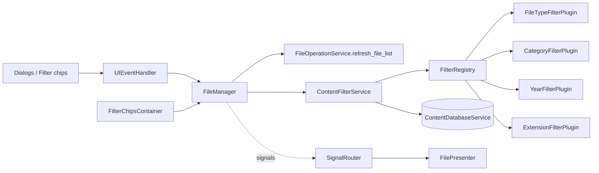
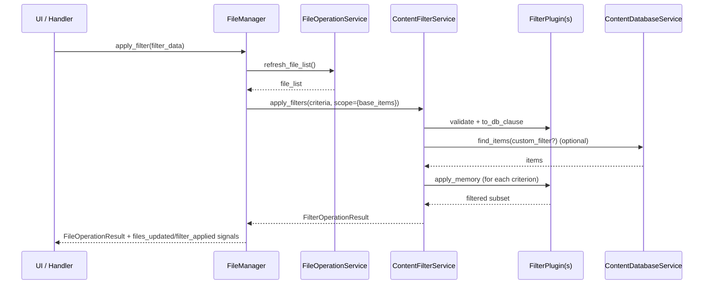

# Filter Operation V1 (Draft)

This document describes the filtering architecture centered on `ContentFilterService` and its plugin pipeline (`file_type`, `category`, `year`, `extension`).

Note (V1.7): filtering responsibility was extracted from `FileOperationService` and is now handled by `services/filtering/ContentFilterService`.

## 1. Goal

- provide a single filtering facade with cumulative logical `AND` behavior;
- separate each criterion into dedicated plugins;
- support hybrid filtering:
  - DB push-down when possible (`file_type`, `category`);
  - in-memory filtering when needed (`year`, `extension`, plus final pass for all plugins);
- keep caller contract stable (`FilterOperationResult`) regardless of plugin internals.

## 2. Result Contract

`ContentFilterService.apply_filters(...)` returns:

```python
@dataclass
class FilterOperationResult:
    success: bool
    code: FilterOperationCode
    message: str
    data: Dict[str, Any] = field(default_factory=dict)
```

Current codes (`FilterOperationCode`):

- `ok`
- `validation_error`
- `unknown_filter`
- `database_error`
- `unknown_error`

## 3. Canonical `data` Keys

- `filtered_files`: final list of `(path, directory)` tuples
- `applied_filters`: normalized criteria list (`[{key, op, value}, ...]`)
- `error`: `None` on success, string on failure

Behavior rules:

- no criteria -> success + original scope in `filtered_files`;
- unknown/invalid criterion -> failure + original scope fallback in `filtered_files`;
- unexpected exception -> failure `unknown_error` + original scope fallback.

## 4. Operation Catalog

| Kind/Action | Method | Main role | Expected `data` keys |
| --- | --- | --- | --- |
| `apply_filters` | `ContentFilterService.apply_filters(criteria, scope)` | Normalize scope/criteria, validate plugins, run DB push-down + in-memory chain | success: `filtered_files`, `applied_filters`, `error=None`; failure: `filtered_files`, `applied_filters` (or `[]`), `error` |
| `register_plugin` | `FilterRegistry.register(plugin)` | Register plugin by unique key | no service payload (raises `ValueError` on duplicate/empty key) |
| `resolve_plugin` | `FilterRegistry.resolve(key)` | Resolve plugin at runtime | plugin instance or `None` |

### 4.1 Default Plugin Catalog

| Key | Allowed ops | DB push-down | Memory pass | Notes |
| --- | --- | --- | --- | --- |
| `file_type` | `eq`, `in` | yes | yes | aliases supported (`image`/`images`, etc.), special support for `uncategorized` |
| `category` | `eq`, `in` | yes | yes | requires `content_map` context during memory pass |
| `year` | `eq`, `in`, `range` | no | yes | multi-source year resolution: model fields -> metadata -> filesystem mtime |
| `extension` | `eq`, `in`, `contains` | no | yes | normalized to lowercase with leading dot |

### 4.2 Special Cases

- `year` intentionally skips DB push-down to preserve fallback behavior (metadata + `mtime` extraction).
- DB read failures in dataset bootstrap trigger scope fallback (warning log), not hard failure.
- Batch cache hydration failures in `_get_content_items_by_path(...)` are non-fatal and partial.
- when `allow_db_fallback=False`, DB failures are propagated explicitly as `database_error`.

## 5. Layer Responsibilities

- `FileManager`:
  - owns active filter UI state (`_active_filters`);
  - converts UI actions/chips into `FilterCriterion` list;
  - calls filtering facade and emits Qt signals (`files_updated`, `filter_applied`).

- `ContentFilterService`:
  - orchestrates criterion normalization and plugin execution order;
  - aggregates DB clauses and loads working dataset;
  - provides plugin context (`content_by_path`, `scope`, `get_content_map`).

- `FilterRegistry`:
  - key -> plugin runtime registry;
  - enforces unique, non-empty keys.

- `FilterPlugin` implementations:
  - criterion-level validation;
  - optional SQLAlchemy clause generation;
  - in-memory filtering logic.

## 6. Exact Mapping (Who Uses What)

### 6.1 Callers -> `FileManager` filtering API

| Caller | Method used | File |
| --- | --- | --- |
| `UIEventHandler.handle_filter_change(...)` | `file_manager.apply_filter(...)` | `src/ai_content_classifier/views/handlers/ui_event_handler.py` |
| `UIEventHandler.handle_category_filter_request(...)` | `file_manager.apply_filter(...)` | `src/ai_content_classifier/views/handlers/ui_event_handler.py` |
| `UIEventHandler.handle_year_filter_request(...)` | `file_manager.apply_filter(...)` | `src/ai_content_classifier/views/handlers/ui_event_handler.py` |
| `UIEventHandler.handle_extension_filter_request(...)` | `file_manager.apply_filter(...)` | `src/ai_content_classifier/views/handlers/ui_event_handler.py` |
| `UIEventHandler` (clear action) | `file_manager.clear_filters()` | `src/ai_content_classifier/views/handlers/ui_event_handler.py` |
| Filter chips interaction | `file_manager.update_filters_from_chips(...)` | `src/ai_content_classifier/views/managers/file_manager.py` |

### 6.2 `FileManager` -> `ContentFilterService`

| `FileManager` method | Called target |
| --- | --- |
| `_apply_cumulative_filters()` | `content_filter_service.apply_filters(...)` |
| `_apply_filters_to_file_list(...)` | `content_filter_service.apply_filters(...)` |

### 6.3 `ContentFilterService` -> plugins/DB

| Facade step | Called target |
| --- | --- |
| default bootstrap | `_register_default_plugins()` |
| key resolution | `registry.resolve(criterion.key)` |
| validation | `plugin.validate(criterion)` |
| DB push-down build | `plugin.to_db_clause(criterion)` |
| initial dataset query | `db_service.find_items(...)` |
| memory pass | `plugin.apply_memory(items, criterion, context)` |
| on-demand content hydration | `_get_content_items_by_path(...)` -> `db_service.find_items(...)` batched |

### 6.4 Explicit Technical Debt

- filtering error codes are now mapped to `FileOperationCode` by `FileManager` and `FileOperationService` (`validation_error`, `unknown_filter`, `database_error`).
- `ContentFilterService` now emits `database_error` explicitly when `allow_db_fallback=False`.

## 7. Mermaid Diagram (UI/Controller -> Filtering Links)



## 8. Mermaid Diagram (Typical Sequence)



## 9. Evolution Convention

- any new filter key must be implemented as a plugin (`validate`, `to_db_clause`, `apply_memory`);
- plugin key must be unique and registered through `FilterRegistry`;
- `apply_filters` output must keep canonical keys (`filtered_files`, `applied_filters`, `error`);
- DB push-down is optional, but in-memory behavior must remain deterministic;
- caller-facing compatibility should be preserved in `FileManager` (`apply_filter`, `clear_filters`, chip sync).

## 10. How To Add A Filter (Procedure)

Use this checklist when introducing a new filter key (for example `source_dir`, `date_range`, `size_range`).

1. Implement a plugin under `services/filtering/plugins/`
   - create `<new_key>_filter.py` with a class exposing:
   - `key = "<new_key>"`
   - `validate(criterion) -> Optional[str]`
   - `to_db_clause(criterion) -> Optional[List[Any]]`
   - `apply_memory(items, criterion, context) -> List[Tuple[str, str]]`
2. Register the plugin in `ContentFilterService._register_default_plugins()`
   - append the plugin in the default bootstrap list.
3. Add caller criteria mapping (UI -> criterion)
   - update `FileManager._build_filter_criteria()` so active UI state maps to `FilterCriterion(key, op, value)`.
   - if needed, add UI selector flow in `UIEventHandler` and filter-chip formatting in `FilePresenter`.
4. Validate error contract compatibility
   - keep `FilterOperationResult.data` canonical keys:
   - `filtered_files`, `applied_filters`, `error`.
   - ensure failures return deterministic `FilterOperationCode`.
5. Add tests before merge
   - plugin unit tests: validation + DB clause behavior + memory filtering.
   - service tests: pipeline integration with the new criterion.
   - contract tests: verify exact `code`/`message`/`data` shape when relevant.
   - UI routing tests if new user-visible behavior is introduced.
6. Update documentation
   - update this document’s plugin catalog and special cases.
   - update `FILE_OPERATIONS_V1.md` and/or `DATABASE_SERVICES_V1.md` if caller-facing behavior changed.
   - add a changelog entry when behavior/contract changes are user-visible.

## 11. Service Versioning

- `V1.7.0`:
  - extraction from file operations into `ContentFilterService`;
  - plugin architecture introduced;
  - cumulative filters unified in one pipeline.
  - UI-level differentiation for filter failure categories in notifications/status toasts.
  - localized (`fr/en`) end-user message templates for each filter failure category.

- Next recommended increment:
  - surface filter error category directly in filter chips/banner (optional UI affordance).

## 12. Document Quality Checklist

- [x] Objective and scope defined.
- [x] Explicit result contract.
- [x] Canonical `data` keys listed.
- [x] Operation catalog completed.
- [x] Dependency mapping documented.
- [x] Special cases and technical debt documented.
- [x] "How to add a filter" procedure included.
- [x] Mermaid diagrams included.
- [x] Evolution and versioning conventions defined.
