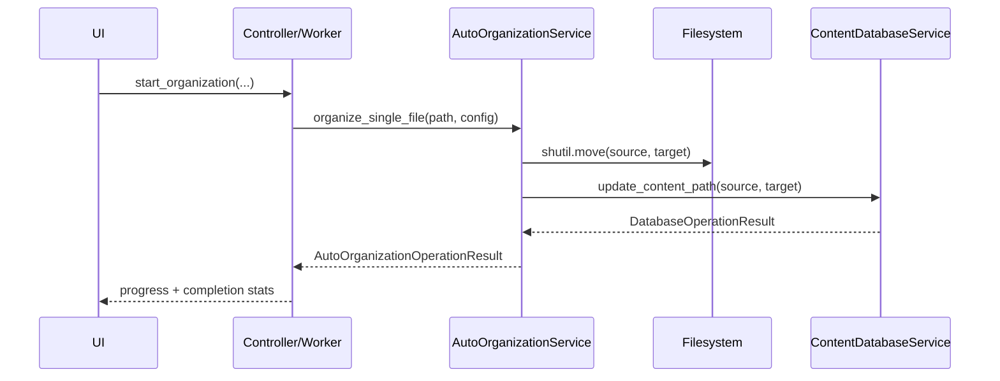

# AutoOrganizationService V1.8.0

Ce document décrit le contrat V1.8 du service d'organisation automatique, aligné avec les conventions des autres services applicatifs.

## 1. Objectif

- Unifier le contrat de retour du service avec un résultat structuré (`success`, `code`, `message`, `data`).
- Structurer le service en package dédié (`types.py`, `operations/`, `service.py`).
- Préparer V1.9 (journal d'opérations move + rollback/reprise) sans introduire la logique V1.9 dans V1.8.

Hors scope V1.8:

- journalisation `move_operations`;
- machine d'états `pending/moved/completed/failed`;
- rollback/reprise automatique.

## 2. Contrat de résultat

```python
class AutoOrganizationOperationCode(str, Enum):
    OK = "ok"
    VALIDATION_ERROR = "validation_error"
    FILESYSTEM_ERROR = "filesystem_error"
    DATABASE_ERROR = "database_error"
    CONFLICT_ERROR = "conflict_error"
    CANCELLED = "cancelled"
    UNKNOWN_ERROR = "unknown_error"

@dataclass
class AutoOrganizationOperationResult:
    success: bool
    code: AutoOrganizationOperationCode
    message: str
    data: dict[str, Any] = field(default_factory=dict)
```

Mode de compatibilité:

- aucun mode de compatibilité legacy n'est conservé;
- les call-sites utilisent directement `AutoOrganizationOperationResult`.

## 3. Clés canoniques de `data`

Clés minimales garanties:

- `source_path`
- `target_path`
- `action`
- `error`

Clés additionnelles V1.8:

- `size_bytes`
- `file_hash` (propagé depuis la DB quand disponible; aucun recalcul forcé par V1.8)

## 4. Catalogue des opérations

| Kind/Action | Méthode | Rôle principal | Clés `data` attendues |
| --- | --- | --- | --- |
| `organize_single_file` | `organize_single_file(file_path, config)` | Orchestration d'une organisation unitaire | succès: `source_path`, `target_path`, `action`, `size_bytes`; échec: + `error` |
| `preview` | `get_organization_preview(file_list, config)` | Simulation non destructive | `structure`, `file_count`, `total_size_mb`, `conflicts` |

Cas particulier V1.8 (move):

- l'opération filesystem est suivie d'un update DB de path via `ContentDatabaseService.update_content_path(...)`;
- si l'update DB échoue, le résultat retourne `database_error` ou `conflict_error`;
- aucun rollback filesystem n'est ajouté en V1.8 (prévu V1.9).

## 5. Responsabilités de couche

- `AutoOrganizationService`:
  - orchestre l'organisation (copy/move + mapping du résultat);
  - standardise les résultats et les codes d'erreur;
  - structure les logs (`code`, `source_path`, `target_path`, `action`).
- `ContentDatabaseService` / `ContentWriter`:
  - effectue la mutation de path (`update_content_path`);
  - préserve le `file_hash` existant sans recalcul involontaire.
- `AutoOrganizationController`:
  - consomme les résultats unifiés;
  - propage progression/erreurs/succès vers la UI.

## 6. Mapping dépendances

### 6.1 Callers -> service

| Caller | Méthode utilisée | Fichier |
| --- | --- | --- |
| `OrganizationWorker` | `AutoOrganizationService.organize_single_file(...)` | `src/ai_content_classifier/controllers/auto_organization_controller.py` |
| `AutoOrganizationController` | `calculate_statistics(...)`, `get_organization_preview(...)` | `src/ai_content_classifier/controllers/auto_organization_controller.py` |

### 6.2 Service -> sous-composants

| Méthode facade | Cible appelée |
| --- | --- |
| `_safe_get_content_item(...)` | `ContentDatabaseService.get_content_by_path(...)` |
| `_perform_file_action(..., action="move")` | `ContentDatabaseService.update_content_path(...)` |
| `_get_available_categories(...)` | `ContentDatabaseService.get_unique_categories(...)` |

## 7. Diagramme (UI/Controller -> service)


## 8. Séquence typique (move V1.8)



## 9. Convention d'évolution

- Toute nouvelle opération publique doit retourner `AutoOrganizationOperationResult`.
- Toute nouvelle clé `data` doit être canonique et documentée ici.
- Les changements de contrat non rétro-compatibles doivent être versionnés.

Dépendance de release:

- V1.9 démarre après finalisation V1.8.
- V1.9 s'appuie sur ce contrat V1.8 pour ajouter journal d'opérations, rollback et reprise.

## 10. Checklist qualité doc

- [x] Objectif/périmètre V1.8 défini
- [x] Contrat de résultat explicite
- [x] Clés canoniques listées
- [x] Mapping des responsabilités documenté
- [x] Lien de dépendance V1.9 explicite
