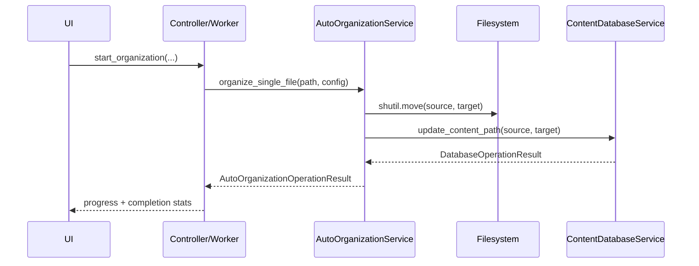

# AutoOrganizationService V1.8.0

This document describes the V1.8 contract for the automatic organization service, aligned with the conventions used by other application services.

## 1. Objective

- Unify the service return contract with a structured result (`success`, `code`, `message`, `data`).
- Structure the service as a dedicated package (`types.py`, `operations/`, `service.py`).
- Prepare V1.9 (move operation journal + rollback/recovery) without introducing V1.9 logic in V1.8.

Out of scope for V1.8:

- `move_operations` journaling;
- explicit state machine (`pending/moved/completed/failed`);
- automatic rollback/recovery.

## 2. Result Contract

```python
class AutoOrganizationOperationCode(str, Enum):
    OK = "ok"
    VALIDATION_ERROR = "validation_error"
    FILESYSTEM_ERROR = "filesystem_error"
    DATABASE_ERROR = "database_error"
    CONFLICT_ERROR = "conflict_error"
    CANCELLED = "cancelled"
    UNKNOWN_ERROR = "unknown_error"

@dataclass
class AutoOrganizationOperationResult:
    success: bool
    code: AutoOrganizationOperationCode
    message: str
    data: dict[str, Any] = field(default_factory=dict)
```

Compatibility mode:

- no legacy compatibility mode is kept;
- call-sites consume `AutoOrganizationOperationResult` directly.

## 3. Canonical `data` Keys

Minimum guaranteed keys:

- `source_path`
- `target_path`
- `action`
- `error`

Additional V1.8 keys:

- `size_bytes`
- `file_hash` (propagated from DB when available; no forced recomputation in V1.8)

## 4. Operation Catalog

| Kind/Action | Method | Main role | Expected `data` keys |
| --- | --- | --- | --- |
| `organize_single_file` | `organize_single_file(file_path, config)` | Single-file organization orchestration | success: `source_path`, `target_path`, `action`, `size_bytes`; failure: + `error` |
| `preview` | `get_organization_preview(file_list, config)` | Non-destructive simulation | `structure`, `file_count`, `total_size_mb`, `conflicts` |

V1.8 move special case:

- filesystem move is followed by DB path update via `ContentDatabaseService.update_content_path(...)`;
- if DB update fails, result returns `database_error` or `conflict_error`;
- no filesystem rollback is added in V1.8 (planned for V1.9).

## 5. Layer Responsibilities

- `AutoOrganizationService`:
  - orchestrates organization (copy/move + result mapping);
  - standardizes result payload and error codes;
  - structures logs (`code`, `source_path`, `target_path`, `action`).
- `ContentDatabaseService` / `ContentWriter`:
  - performs path mutation (`update_content_path`);
  - preserves existing `file_hash` without unintended recomputation.
- `AutoOrganizationController`:
  - consumes unified results;
  - propagates progress/errors/success to UI.

## 6. Dependency Mapping

### 6.1 Callers -> service

| Caller | Method used | File |
| --- | --- | --- |
| `OrganizationWorker` | `AutoOrganizationService.organize_single_file(...)` | `src/ai_content_classifier/controllers/auto_organization_controller.py` |
| `AutoOrganizationController` | `calculate_statistics(...)`, `get_organization_preview(...)` | `src/ai_content_classifier/controllers/auto_organization_controller.py` |

### 6.2 Service -> sub-components

| Facade method | Called target |
| --- | --- |
| `_safe_get_content_item(...)` | `ContentDatabaseService.get_content_by_path(...)` |
| `_perform_file_action(..., action="move")` | `ContentDatabaseService.update_content_path(...)` |
| `_get_available_categories(...)` | `ContentDatabaseService.get_unique_categories(...)` |

## 7. Diagram (UI/Controller -> service)


## 8. Typical Sequence (V1.8 move)



## 9. Evolution Convention

- Any new public operation must return `AutoOrganizationOperationResult`.
- Any new `data` key must be canonical and documented here.
- Any non-backward-compatible contract change must be versioned.

Release dependency:

- V1.9 starts after V1.8 is finalized.
- V1.9 builds on this V1.8 contract to add operation journaling, rollback, and recovery.

## 10. Doc Quality Checklist

- [x] V1.8 objective/scope defined
- [x] Result contract explicitly documented
- [x] Canonical keys listed
- [x] Responsibility mapping documented
- [x] V1.9 dependency explicitly documented
