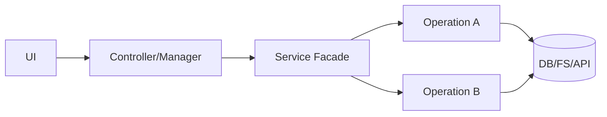
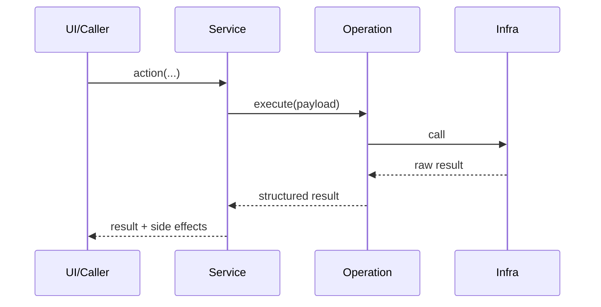

# [Nom du service] V[Version] (Draft)

Ce document standardise la documentation d'un service applicatif (architecture, contrats, usages, évolutions).

## 1. Objectif

- décrire le rôle métier du service ;
- clarifier ce qui est dans le scope et hors scope ;
- expliciter les invariants attendus (cohérence, idempotence, safe-fail, perf).

## 2. Contrat de résultat

Documenter le format de retour consommé par les couches appelantes.

Exemple :

```python
@dataclass
class ServiceOperationResult:
    success: bool
    code: ServiceOperationCode
    message: str
    data: dict[str, Any] = field(default_factory=dict)
```

Codes minimaux recommandés :

- `ok`
- `invalid_input`
- `not_found`
- `partial_success`
- `unknown_error`

Si le service n'utilise pas de résultat structuré, l'indiquer explicitement (retours primitifs, exceptions propagées, dette technique).

## 3. Clés `data` canoniques

Lister les clés standardisées attendues dans `result.data`.

Exemple :

- `items`
- `item_by_id`
- `deleted_count`
- `normalized_ids`
- `error`

Règle :

- une clé = une sémantique stable ;
- éviter les alias multiples pour le même concept.

## 4. Catalogue des opérations

Lister les opérations exposées par le service.

| Kind/Action | Méthode | Rôle principal | Clés `data` attendues |
| --- | --- | --- | --- |
| `example_action` | `example_action(...)` | Décrire le comportement | succès: `...`; échec: `error` |

### 4.1 Cas particuliers

Documenter ici les exceptions de flux :

- opérations qui contournent la façade ;
- variations de comportement selon plateforme ;
- compatibilité transitoire (shim, legacy path).

## 5. Rôle des couches

Décrire qui fait quoi.

- `[ServiceFacade]` :
  - orchestration ;
  - délégation ;
  - normalisation des retours.
- `[Operation/Reader/Writer/etc.]` :
  - logique métier unitaire ;
  - accès infra ;
  - conversions de payload.
- `[Manager/Controller/UI]` :
  - consommation des résultats ;
  - mapping messages utilisateur ;
  - émission de signaux/events.

## 6. Cartographie exacte (qui utilise quoi)

### 6.1 Appelants -> façade

| Appelant | Méthode utilisée | Fichier |
| --- | --- | --- |
| `Ex: UIEventHandler` | `ex: service.do_x(...)` | `src/...` |

### 6.2 Façade -> sous-composants

| Méthode façade | Cible appelée |
| --- | --- |
| `do_x(...)` | `XOperation.execute(...)` |

### 6.3 Dette technique explicite

- `TODO([TAG])`: décrire clairement le réalignement attendu.

## 7. Schéma Mermaid (liens UI/Controller -> service)



## 8. Schéma Mermaid (séquence type)



## 9. Convention d'évolution

- toute nouvelle opération doit passer par la façade ;
- tout nouveau payload doit utiliser des clés canoniques ;
- tout changement cassant de contrat doit être versionné et documenté ;
- toute couche de compatibilité doit avoir une stratégie de retrait.

## 10. Versionner le service

Format recommandé :

- `Vx.y.0` : correctifs critiques / stabilité ;
- `Vx.y.1` : refonte contrat / simplification interne ;
- `Vx.y.2` : extraction de responsabilités / extensibilité.

Inclure pour chaque version :

- objectifs ;
- changements de contrat ;
- impacts appelants ;
- migrations nécessaires ;
- tests de non-régression.

## 11. Checklist qualité du document

- [ ] Objectif et périmètre définis.
- [ ] Contrat de résultat explicite (ou dette signalée).
- [ ] Clés `data` canoniques listées.
- [ ] Catalogue des opérations complété.
- [ ] Cartographie des dépendances renseignée.
- [ ] Cas particuliers/dettes techniques documentés.
- [ ] Schémas Mermaid présents et lisibles.
- [ ] Convention d'évolution et versioning définis.
