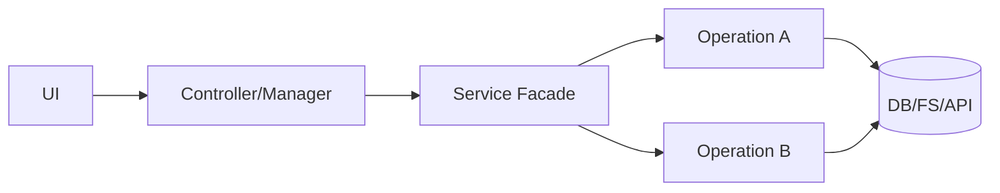
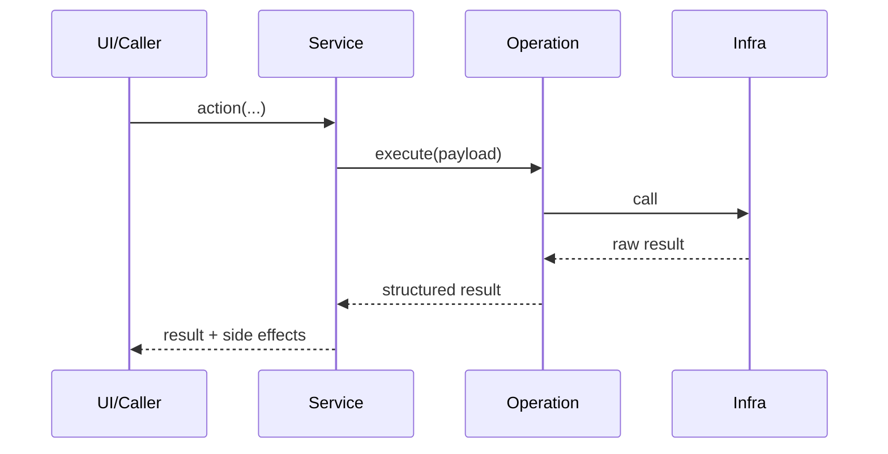

# [Service Name] V[Version] (Draft)

This document standardizes the documentation of an application service (architecture, contracts, usage, evolution).

## 1. Objective

- describe the service's business role;
- clarify what is in scope and out of scope;
- make expected invariants explicit (consistency, idempotence, safe-fail, performance).

## 2. Result contract

Document the return format consumed by calling layers.

Example:

```python
@dataclass
class ServiceOperationResult:
    success: bool
    code: ServiceOperationCode
    message: str
    data: dict[str, Any] = field(default_factory=dict)
```

Recommended minimum codes:

- `ok`
- `invalid_input`
- `not_found`
- `partial_success`
- `unknown_error`

If the service does not use a structured result, state it explicitly (primitive returns, propagated exceptions, technical debt).

## 3. Canonical `data` keys

List standardized keys expected in `result.data`.

Example:

- `items`
- `item_by_id`
- `deleted_count`
- `normalized_ids`
- `error`

Rule:

- one key = one stable semantic meaning;
- avoid multiple aliases for the same concept.

## 4. Operation catalog

List operations exposed by the service.

| Kind/Action | Method | Main role | Expected `data` keys |
| --- | --- | --- | --- |
| `example_action` | `example_action(...)` | Describe behavior | success: `...`; failure: `error` |

### 4.1 Special cases

Document flow exceptions here:

- operations that bypass the facade;
- platform-dependent behavior variations;
- transitional compatibility (shim, legacy path).

## 5. Layer responsibilities

Describe who does what.

- `[ServiceFacade]` :
  - orchestration;
  - delegation;
  - return normalization.
- `[Operation/Reader/Writer/etc.]` :
  - unit business logic;
  - infrastructure access;
  - payload conversions.
- `[Manager/Controller/UI]` :
  - result consumption;
  - user message mapping;
  - signal/event emission.

## 6. Exact mapping (who uses what)

### 6.1 Callers -> facade

| Caller | Method used | File |
| --- | --- | --- |
| `Ex: UIEventHandler` | `ex: service.do_x(...)` | `src/...` |

### 6.2 Facade -> sub-components

| Facade method | Called target |
| --- | --- |
| `do_x(...)` | `XOperation.execute(...)` |

### 6.3 Explicit technical debt

- `TODO([TAG])`: clearly describe the expected realignment.

## 7. Mermaid diagram (UI/Controller -> service links)



## 8. Mermaid diagram (typical sequence)



## 9. Evolution convention

- every new operation must go through the facade;
- every new payload must use canonical keys;
- every breaking contract change must be versioned and documented;
- every compatibility layer must have a removal strategy.

## 10. Service versioning

Recommended format:

- `Vx.y.0` : critical fixes / stability;
- `Vx.y.1` : contract redesign / internal simplification;
- `Vx.y.2` : responsibility extraction / extensibility.

For each version include:

- objectives;
- contract changes;
- caller impacts;
- required migrations;
- non-regression tests.

## 11. Document quality checklist

- [ ] Objective and scope defined.
- [ ] Explicit result contract (or debt noted).
- [ ] Canonical `data` keys listed.
- [ ] Operation catalog completed.
- [ ] Dependency mapping documented.
- [ ] Special cases/technical debt documented.
- [ ] Mermaid diagrams present and readable.
- [ ] Evolution and versioning conventions defined.
